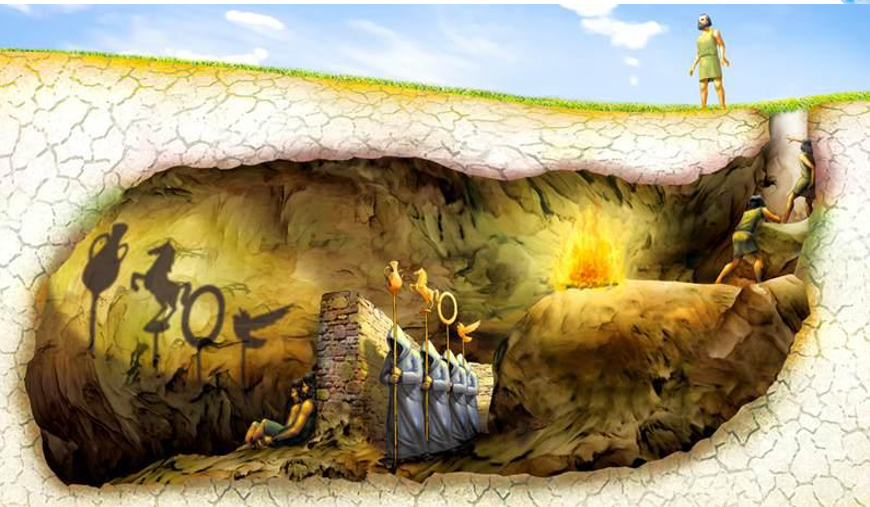
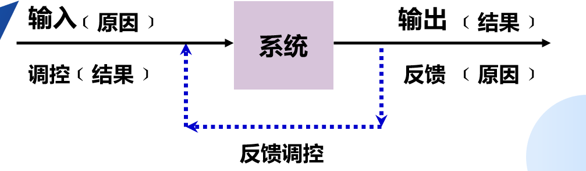
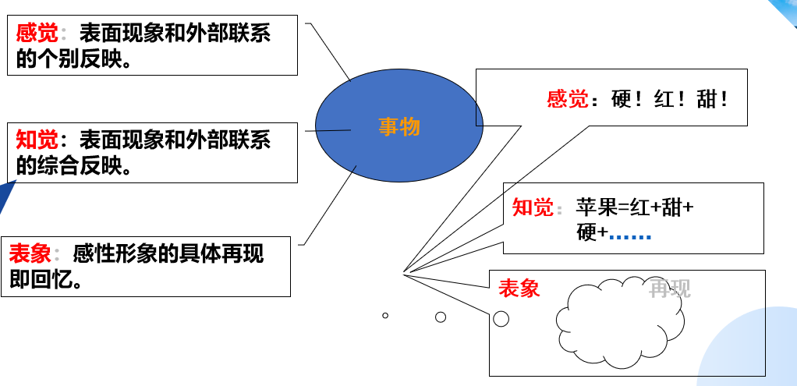
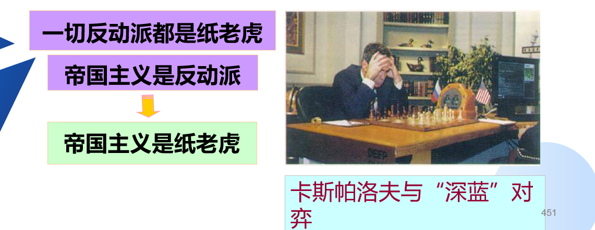
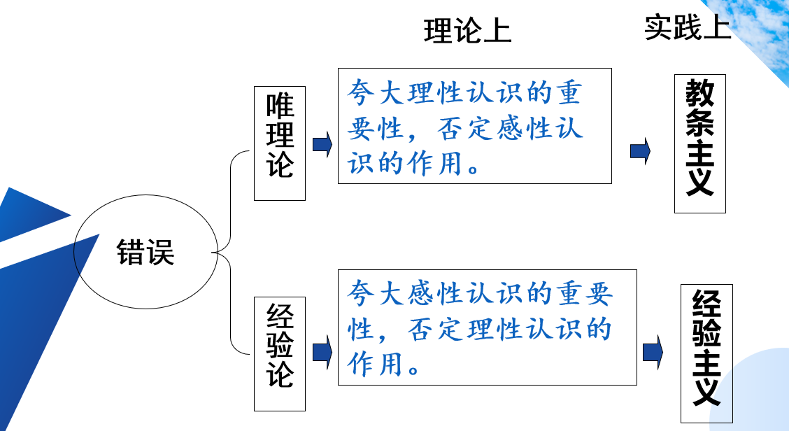
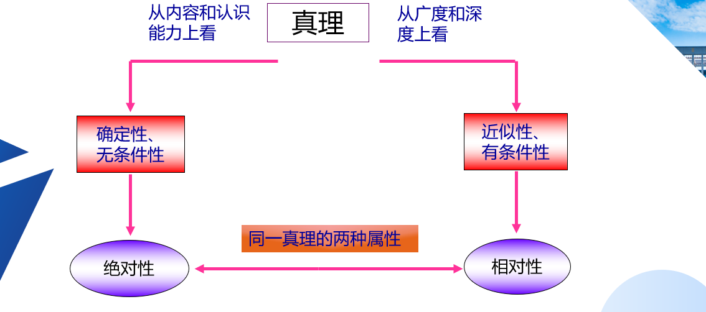
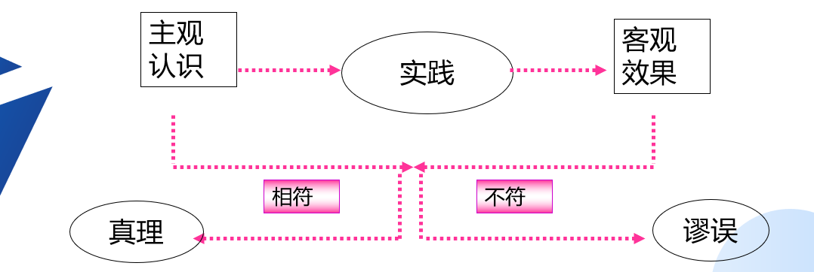
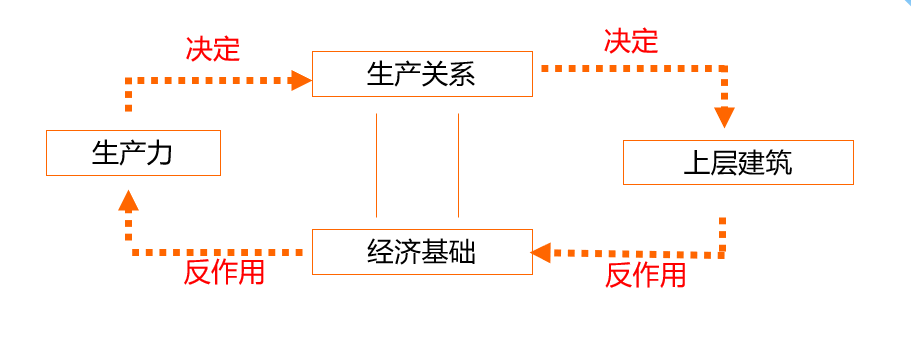
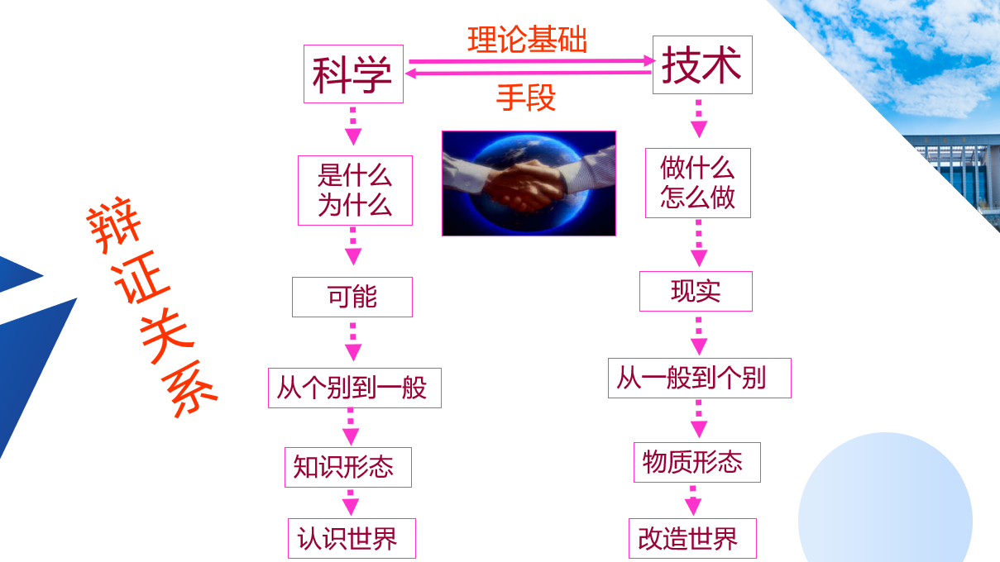
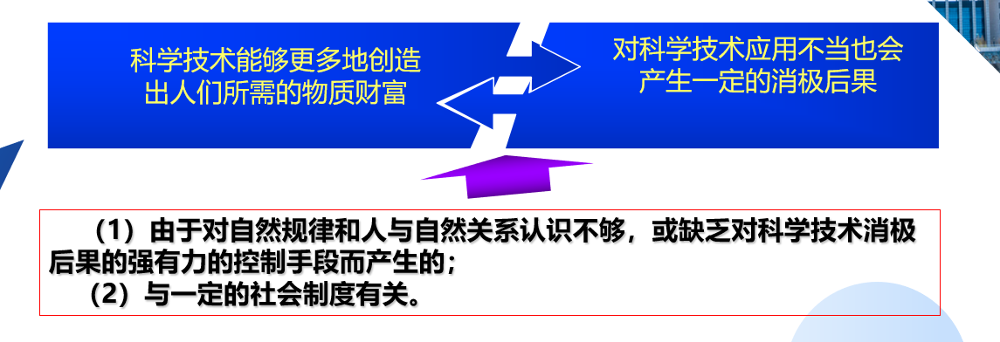

# 开课说明

## 一、在课堂纪律上：希望各位不要：
1. 迟到、早退
2. 随意进出课堂
3. 在课堂上说话！
4. 有事有病可请假， 需要正式的请假条。
  
## 二、关于你们的成绩
1. 平时成绩：20%（考勤和作业）
2. 期中考试：20% （开卷）
3. 期末考试:   60%（全校统考，闭卷）

## 三、教材问题
1. 导论
2. 哲学（第一、二、三章）
3. 政治经济学（第四、五章）
4. 科学社会主义（第六、七章）

# 第一章 导论

## 第一节：回到马克思

### 一、马克思主义在中国的现状

1. 学校的思政课
   1. 上级很重视
   2. 教师很努力
   3. 学生很无奈
2. 党员干部的信仰:在党员干部中，非马克思主义倾向。不信马列信鬼神。国家行政学院主持的一项调查显示，全国17个省市单位和副省级城市的900名县处级官员中，“很相信”、“有些相信”和“相信”风水迷信的比例达到21%左右。
   1. 言行不一，形式上的马克思主义：“过去的一切运动都是少数人的，或者是为少数人谋利益的运动。无产阶级的运动是绝大多数人的，为绝大多数人谋利益的独立的运动。”（文集第2卷，第42页）
3. 传播和宣传过程中的失真
   1. 当马克思主义上升为国家意志时，一些人往往将其变为政策解释学。我们把经典作家相片化，把马克思主义这种鲜活的理论教条化，甚至伪科学化。
      1. “共产主义对我们来说不是应当确立的状况，不是现实应当与之相适应的理想。我们所称为共产主义的是那种消灭现存状况的现实的运动。” ——《德意志意识形态》
      2. “我播下的是龙种，收获的是跳蚤” “我不是马克思主义者”  —— 马克思
   2. 一些人对马克思主义的恶意的攻击和肆意歪曲。还有许多人把中国社会的不良社会现象乱象的原因归结于马克思主义。
      1. 有人说：马克思有私生子，道德败坏。
      2. 有人说：马克思和恩格斯是一对好基友
      3. 还有人说：马克思改变了我的思想，马化腾改变了我的交流方式，马云改变了我的消费观念，马蓉颠覆了我的婚姻观。
4. 社会信仰危机
   1. 失去了精神家园，我们变成了迷途的羔羊。“敬鬼神而远之”“子不语怪力乱神” “我生本无乡，心安是归处。”
   2. 没有信仰也会使得中国人犯了错也无处忏悔，精神的痛苦无处发泄。
      1. 青年佛系，中年油腻，我们指望谁？
      2. “人民有信仰，民族有希望，国家有力量”
   3. 社会走向资本丛林：金钱和权力成为一些人的信仰和追求
      1. 第一，我们没有了判断善恶、是非、美丑的标准，没有了追求正义、真理和光明的目标与动力。
         1. 娘炮文化盛行：安能辨我是雌雄
         2. 马云爸爸
         3. 国民老公
         4. 吴亦凡被捕后脑残粉奇葩的言论
      2. 第二，我们失去了生活的本质，失去了自我，过着一种不真实的生活。
         1. “货币的力量多大，我的力量就多大。因此，我是什么和我能够做什么，绝不是由我的个性特征决定的。我是丑的，但我能给我买到最美的女人。可见，我并不丑，因为丑的作用，丑的吓人的力量，被货币化为乌有了。我是一个邪恶的、不诚实的、没有良心的、没有头脑的人，可是货币是受尊敬的。因此，它的占有者也受尊敬。”——《1844年经济学哲学手稿》文集第一卷244-245页。
      3. 第三，人与人之间的关系被异化了。
         1. 资产阶级“使人和人之间除了赤裸裸的利害关系，除了冷酷无情的‘现金交易’，就再也没有任何别的联系了。它把宗教虔诚、骑士热忱、小市民的伤感这些神圣发作，淹没在利己主义打算的冰水之中。它把人的尊严变成了交换价值。”“资产阶级抹去了一切向来受人尊崇和令人敬畏的职业的神圣光环。它把医生、律师、教士、诗人和学者变成了它出钱招雇的雇佣劳动者。”“资产阶级撕下来罩在家庭关系上的温情脉脉的面纱，把这种关系变成了纯粹的金钱关系。”——《共产党宣言》文集第2卷，第34页。
      4. 第四，道德甚至法律遭到践踏
         1. 如果有百分之二十的利润，资本就会蠢蠢欲动；如果有百分之五十的利润，资本就会冒险；如果有百分之一百的利润，资本就敢于冒绞首的危险；如果有百分之三百的利润，资本就敢于践踏人间一切法律。——马克思

### 二、回到马克思（1818年5月5日——1883年3月14日）

1. 穷人马克思
   1. 燕妮写给约瑟夫·魏德迈的信：“因为这里奶妈工钱太高，我尽管前胸后背都经常疼得厉害，但还是自己给孩子喂奶。这个可怜的孩子从我身上吸去了那么多的悲伤和忧虑，所以他一直体弱多病，日日夜夜忍受着剧烈的痛苦。他从出生以来，还没有一夜能睡着二三个小时以上的。最近又加上剧烈的抽风，所以孩子终日在死亡线上挣扎。由于这些病痛，他拼命地吸奶，以致我的乳房被吸伤裂口了；鲜血常常流进他那抖动的小嘴里。
   2. 有一天，我正抱着他坐着，突然女房东来了，要我付给她五英镑的欠款，可是我们手头没有钱。于是来了两个法警，将我的菲薄的家当——床铺衣物等——甚至连我那可怜孩子的摇篮以及比较好的玩具都查封了。他们威胁我说两个钟头以后要把全部东西拿走。我只好同冻得发抖的孩子们睡光板了。”
   3. 1852年2月27日马克思在给恩格斯的信：“一个星期以来，我已达到非常痛苦的地步：因为外衣进了当铺，我不能再出门，因为不让赊帐，我不能再吃肉。”不久又写信向恩格斯倾诉：“我的妻子病了，小燕妮病了，家里没钱请医生，没钱买药。八至十天以来，家里吃的是面包和土豆，今天是否能够弄到这些，还成问题。” 
2. 理论家马克思
   1. 卡尔.马克思(1818年5月5日-1883年3月14日)，他出生在德国莱茵省特利尔城的一个中产阶级家庭，中学毕业后马克思先在波恩大学念书，曾在这里有过一段放浪形骸的日子，他酗酒、私带武器搞决斗。喝酒决斗之余，马克思的大部分时间就用来搞诗歌创作。如果按此情形发展下去，世界会多一个三流浪漫主义不靠谱诗人。
   2. 一年后，马克思转学到学风比较严谨的柏林大学，主要学习哲学和历史。接触到了黑格尔和费尔巴哈的哲学。
   3. 1835年，大卫·施特劳斯《耶稣传》一书出版。由此，导致了黑格尔学派的分裂：老年黑格尔派和青年黑格尔派（马克思是青年黑格尔派的主要分子）
   4. 1841年费尔巴哈发表《基督教的本质》提出上帝是人的本质的异化
   5. 1844年，马克思写作了《1844年经济学哲学手稿》提出异化劳动理论：
   6. 词源：18世纪资产阶级思想家的用语。表示权利的转让；关系的疏远；精神错乱。
      1. 劳动者和劳动产品相异化；
      2. 劳动者与劳动过程相异化；
      3. 人与自己的本质相异化；
      4. 人际关系的异化
      5. （异化是主体在发展自身的过程中，产生出一个对立面，它反过来反对和制约主体自身。）
   7. 1845年马克思发表《关于费尔巴哈的提纲》
      1. 恩格斯称之为“包含着新世界观的天才萌芽的第一个文件”。
      2. “哲学家们只是用不同的方式解释世界，而问题在于改变世界”
   8. 1846 年马克思发表《德意志意识形态》历史的出发点是：“现实的人”
   9. 1847年《哲学的贫困》
   10. 1848年《共产党宣言》“无产者失去的只是锁链，得到的将是整个世界。”
   11. 1849年《雇佣劳动与资本》
   12. 1852年《路易波拿巴的雾月十八日》
   13. 1867年《资本论》第一卷发表
   14. 1871年《法兰西内战》
   15. 至此，马克思完成华丽丽地转身，修炼成为**一代宗师**。
   16. 多面的马克思：
       1. 一个多情的马克思。
       2. 悲天悯人的人道主义思想家。
       3. 激情满怀的革命家。
       4. 目光锐利的政治经济学家。
       5. 思想深邃的哲学家。
3. 千年牛人马克思
   1. 媒体的评价
      1. 1999年英国广播公司评选当代最伟大的人物：  马克思高居榜首，第二名是爱因斯坦、第三是牛顿和进化论。
      2. 1999年英国路透社评选：马克思仅以一分之差名列第二，名列第一的是爱因斯坦。与马克思并列第二的是印度的国父“圣雄”甘地。
      3. 2001年英国广播公司BBC，千年伟人评选，经过在国际互联网上经过反复评选，最后的结果是：马克思排在第一位。 
      4. 2005年英国广播公司评选最伟大的哲学家,马克思以27.93％的得票率荣登榜首。 
      5. 2005年德国评选最伟大人物：在德国《图片报》和国家第二电视台携手主办的评选中，马克思被评为“德国最伟大人物”
   2. 学者评价
      1. 法国存在主义哲学家萨特：“马克思主义远远没有穷尽，相反，它相当年轻，几乎还处于婴儿期；它几乎没有开始发展。因此，它仍然是我们时代的哲学，我们不能超越马克思主义。”
      2. 后现代主义哲学家德里达：“不能没有马克思，没有马克思，没有对马克思的记忆，没有马克思的遗产，也就没有将来。”《马克思的幽灵》）
   3. 习近平对马克思的评价
      1. 马克思的一生，是**胸怀崇高理想、为人类解放不懈奋斗**的一生。《纪念马克思诞辰200周年大会上的讲话》“‘如果我们选择了最能为人类而工作的职业，那么，重担就不能把我们压倒，因为这是为大家作出的牺牲；那时我们所享受的就不是可怜的、有限的、自私的乐趣，我们的幸福将属于千百万人，我们的事业将悄然无声地存在下去，但是它会永远发挥作用，而面对我们的骨灰，高尚的人们将洒下热泪。‘马克思一生饱尝颠沛流离的艰辛、贫病交加的煎熬，但他初心不改、矢志不渝，为人类解放的崇高理想而不懈奋斗，成就了伟大人生。”《青年在选择职业时的考虑》
      2. 马克思的一生，是**不畏艰难险阻、为追求真理而勇攀思想高峰**的一生。马克思曾经写道：“在科学上没有平坦的大道，只有不畏劳苦沿着陡峭山路攀登的人，才有希望达到光辉的顶点。” 马克思在给友人的信中谈到，为了《资本论》的写作，“我一直在坟墓的边缘徘徊。因此，我不得不利用我还能工作的每时每刻来完成我的著作”。即使在多病的晚年，马克思仍然不断迈向新的科学领域和目标，写下了数量庞大的历史学、人类学、数学等学科笔记。正如恩格斯所说：“马克思在他所研究的每一个领域，甚至在数学领域，都有独到的发现，这样的领域是很多的，而且其中任何一个领域他都不是浅尝辄止。”
      3. 马克思的一生，是**为推翻旧世界、建立新世界而不息战斗**的一生。恩格斯说，“马克思首先是一个革命家”，“斗争是他的生命要素。很少有人像他那样满腔热情、坚韧不拔和卓有成效地进行斗争”。马克思毕生的使命就是为人民解放而奋斗。为了改变人民受剥削、受压迫的命运，马克思义无反顾投身轰轰烈烈的工人运动，始终站在革命斗争最前沿。他领导创建了世界上第一个无产阶级政党——共产主义者同盟，领导了世界上第一个国际工人组织——国际工人协会，热情支持世界上第一次工人阶级夺取政权的革命——巴黎公社革命，满腔热情、百折不挠推动各国工人运动发展。

### 三、叛经离道恩格斯

1. “高富帅”恩格斯
   1. 弗里德里希•恩格斯（1820年11月28日-1895年8月5日) 恩格斯是一个典型的富二代，他的家庭出身是当时德国巴门市的豪门望族。
   2. 马克思的女儿艾琳娜在1890年说：“也许这种家庭还从来不曾有过像他那样生活道路完全和家世背道而驰的子弟。在这个家庭里弗里德里希被看做‘丑小鸭’是可以想见的。也许他的亲属直到现在还不了解这只‘小鸭’原来是只‘天鹅’。”
2. 无私奉献恩格斯
   1. 马克思、恩格斯的革命友谊长达40年。正如列宁所说：“古老传说中有各种非常动人的友谊故事”，但马克思、恩格斯的友谊“超过了古人关于人类友谊的一切最动人的传说”。马克思无私资助革命事业，即使在自己生活极度困难的情况下仍然尽最大努力帮助革命战友。
   2. 列宁说：“如果不是恩格斯牺牲自己而不断给予资助，马克思不但不能写成《资本论》而且势必会死于贫困。”对恩格斯的无私奉献,马克思非常感动,也十分不安，他在1867年致恩格斯的信中写道：“坦白地向你说，我的良心经常像被梦魔压着一样感到沉重，因为你的卓越才能主要是为了我才浪费在经商上，才让它们荒废，而且还要分担我的一切琐碎的忧患。”
3. 追求自由的恩格斯
   1. 恩格斯是一个非常摩登的人。他一生未婚。在1843年和纺织女工玛丽.白恩士开始同居，直至1863年玛丽去世，而后恩格斯与玛丽的妹妹莉希同居，他一直不办理结婚手续，因为他曾经说：结婚，那些经过国家批准并在教堂举行的仪式都是多余的,没有必要。 

### 四、回到真实的马克思主义

1. 反对者的的攻击和曲解
   1. 在马克思恩格斯时代，反对者的曲解和歪曲
      1. 第一，把马克思主义歪曲为对黑格尔和费尔巴哈的抄袭
      2. 第二，把马克思主义歪曲为“经济决定论”
   2. “西方马克思主义者”的“修正”
      1. 第一，老年马克思和青年马克思的对立。
      2. 第二，“马克思与恩格斯的对立”
      3. 第三，马克思恩格斯和列宁的对立 
2. 理论自信：马克思主义没有过时
   1. 马克思主义经典著作中的个别论点或者某些论断已经过时
      1. “到目前为止的一切社会的历史都是阶级斗争的历史。”（《共产党宣言》第一章）
      2. “由于最近25年来大工业有了巨大发展而工人阶级政党组织也跟着发展起来，由于首先有了二月革命的实际经验 而后来尤其是有了无产阶级第一次掌握政权达两个月之久的巴黎公社的实际经验，所以这个纲领现在有些地方已经过时了”。（《共产党宣言》1872年德文版序言）
   2. 马克思主义理论在当代仍然具有极强的解释力。真正掌握了马克思的学说，它会帮你分析社会，认清现实。
      1. 1997年亚洲金融风暴爆发 ，2008年美国次贷危机爆发。在德国，《资本论》和《共产党宣言》脱销。 2014年英国《泰晤士报》报道说，马克思又回到了欧洲。
   3. 马克思主义是一个开放的体系。新时代中国特色社会主义理论是马克思主义中国化的产物。
    
3. 制度自信：社会主义的优越性
   1. 第一，衡量社会进步的根本标志是生产力的发展
      1. “无产阶级将利用自己的政治统治，一步一步地剥夺资产阶级的全部资本，并尽可能增加生产力总量。”（《共产党宣言》第二章）
      2. “社会主义就是解放生产力，发展生产力，消灭剥削，消除两极分化，最终达到共同富裕。”（邓小平·南方谈话）
   2. 第二，社会主义制度的优越性还体现在“五位一体”的协调发展，最终是人的全面发展。
      1. 经济发达
      2. 政治昌明
      3. 文化深厚
      4. 社会稳定
      5. 生态和谐
4. 什么是马克思主义
   1. 定义：马克思主义就是由马克思、恩格斯创立的，为他们的后来继承者所不断发展的科学理论体系，是关于自然、社会和人类思维发展一般规律的学说，是关于社会主义必然代替资本主义、最终实现共产主义的学说，是关于无产阶级解放、全人类解放和每个人自由全面发展的学说，是指引人民创造美好生活的行动指南。（p2）（五个是）
   2. 马克思主义的直接理论来源
      1. 古典经济学的理论贡献
         1. 代表人物：古典经济学理论的代表人物是英国的威廉．配第、大卫．李嘉图和西斯蒙第。其中，最具有代表性的人物是英国的亚当．斯密和法国重农学派的创始人魁奈。
         2. 英法古典经济学的理论贡献：
            1. 第一，它奠定了劳动价值的基础。
            2. 第二，古典经济学家比较深入地探讨了分工问题。
            3. 第三，古典经济学家对资本主义社会的阶级结构和对立状况进行了经济上的分析。
      2. 空想社会主义
         1. 代表人物：产生于19世纪上半叶的空想社会主义，其主要代表人物是法国的圣西门、傅立叶和英国的欧文。
         2. 第一，论证人类社会的历史是一个由低级到高级的发展过程，资本主义社会只是发展过程中的一个阶段。
         3. 第二，空想社会主义者触及到了社会存在和发展的物质基础问题，试图用社会经济状况来说明政治制度。
         4. 第三，空想社会主义者看到阶级斗争在历史发展中的作用。
         5. 第四，空想社会主义者在对未来社会的预测中，也提出不少合理的思想。
      3. 德国古典哲学
         1. 代表人物：康德、费希特、谢林、黑格尔和费尔巴哈。其中与马克思主义哲学的关系最为密切的，是黑格尔哲学和费尔巴哈哲学。
         2. 德国古典哲学的贡献主要是：
            1. 第一，它把思维和存在、主体和客体的关系作为最重要的哲学问题来研究。
            2. 第二，德国古典哲学的最大成就，是在唯心主义的基础上全面而深刻地研究了辩证的发展观。                                
            3. 第三，德国古典哲学，特别是黑格尔哲学的另一个重要贡献，是在历史观上提出不少深刻的、有价值的思想。

### 五、马克思主义的历史分期

1. 马克思主义产生、发展及其在欧洲的传播（19世纪40年代中期到19世纪末期）
   1. 这一阶段内部阶段的划分。19世纪的分期是比较简单的，已经得到大多数学者的认可，这一时期可以分为四个小的阶段：
   2. 1841—1844年，是马克思主义从萌芽到形成的阶段。
      1. 《<黑格尔法哲学批判>导言》（1843年10月）
      2. 《论犹太人问题》 （1843年10月） 
      3. 《1844年经济学哲学手稿》《英国工人阶级状况》（1844年5月）
   3. 1844—1845年马克思主义的产生
      1. 《关于费尔巴哈的提纲》（1845年春）
      2. 《德意志意识形态》（1845秋—1846年5月）
      3. 《哲学的贫困》（1847年）
      4. 《共产党宣言》（1848年2月）
   4. 1848-----1871年，是马克思主义在欧洲革命运动和政治经济学研究中的运用、检验和发展阶段
      1. 《1848—1850的法兰西阶级斗争》 （1849年3月）
      2. 《法兰西内战》（1871年4月）
      3. 《哥达纲领批判》（1875年4月）
   5. 1871-----1900年，是马克思主义学系统化和进一步传播、发展的阶段。
      1. 《社会主义由空想到科学的发展》（1880年1月）
      2. 《家庭、私有制和国家的起源》（1884年3月）
      3. 《路·费尔巴哈和德国古典哲学的终结》（1886年初）
      4. 《资本论》第一、二、三卷《自然辩证法》（1873-1882年）
2. 马克思主义在世界各国的传播和发展（19世纪末到20世纪40年代中期）。
   1. 1900---1917年为马克思主义在无产阶级革命时代运用和发展并向全世界传播的阶段。
      1. 《弗里德里希·恩格斯》（1895年9月）
      2. 《唯物主义与经验批判主义》（1908年2月）
      3. 《论马克思主义发展中的几个特点》（1910年12月）
      4. 《马克思主义学说的历史命运》（1913年3月）
      5. 《卡尔·马克思》（1914年11月）
      6. （《帝国主义是资本主义的最高阶段》（1916年6月）
   2. 1917---1949年为马克思主义在社会主义国家无产阶级政权的支持下，进一步传播和发展阶段。
      1. .《国家与革命》（1917年8月）
      2. 《列宁专题文集》（论资本主义；论社会主义；论无产阶级政党；论马克思主义；论辩证唯物主义和历史唯物主义）
3. 马克思主义哲学在世界各国的研究和曲折发展（20世纪40年代中期至今）。
   1. 马克思主义中国化的成果
      1. 毛泽东：《中国社会各阶级分析》《湖南农民运动调查报告》《反对本本主义》《实践论》《矛盾论》（以上均在选集，第一卷，1991年版）《改造我们的学习》（第三卷）《关于正确处理人民内部矛盾的问题》《论十大关系》等。
      2. 邓小平：《南方谈话》
   2. 西方马克思主义
      1. 早期西方马克思主义的主要代表： 
         1. 卢卡奇（匈牙利）《历史与阶级意识》《审美特征》《社会存在本体论》
         2. 柯尔施（德国）《马克思主义和哲学》《卡尔·马克思》
         3. 葛兰西（意大利）《狱中札记》《反对<资本论>的革命》
      2. 20世纪30到70年代（繁荣阶段）：法兰克福学派、存在主义的马克思主义、佛洛依德的马克思主义、新实证主义的马克思主义等
      3. 20世纪70年代至今：新法兰克福学派、分析哲学的马克思主义、生态学马克思主义、马克思主义的批评学派、后马克思主义等。

### 六、把读原著、悟原理当做一种生活习惯

1. 延安时期，毛泽东推荐5本书：《共产党宣言》《社会主义由空想到科学的发展》《在民主革命中社会民主党的两个策略》《共产主义运动中的“左派幼稚病”》《联共（布）党史简明教程》。他在延安抗大时亲自讲授了：《实践论》《矛盾论》
2. “马克思主义经典著作是马克思主义理论的本源。学习马克思主义经典著作，有利于从源头上完整准确地理解马克思主义，系统掌握马克思主义科学真理，也有利于深化对中国特色社会主义理论体系的理解和运用。没有马克思主义的理论基础，就谈不上把马克思主义基本原理同中国具体实际相结合。”（习近平：“做好新形势下干部教育培训工作”讲话）
3. 共产党人要把读马克思主义经典著作、悟马克思主义原理当作一种生活习惯，当作一种精神追求，用经典涵养正气、淬炼思想、升华境界、指导实践。——习近平《纪念马克思诞辰200周年大会上的讲话》
4. 总之，回到经典，学习原著是由于：树立坚定的信仰，与各种错误思潮作斗争，从根本上理解马克思主义的精神实质的需要

## 第二节 哲学和哲学的基本问题

### 一、关于哲学

1. 词源：
   1. 最早提出这一概念的是古希腊哲学家毕达哥拉斯，意为“爱智慧。”在中国古代是没有哲学这个词的，但是有类似的说法，叫“哲人”或者“先哲”是指那些善于思辨，有学问的人。1874年，日本学者西周，他把英语philosphy一词翻译成汉语“哲学”，1896年前后，康有为把它传入中国并逐渐为人们所接受。
   2. 哲学是关于智慧的智慧。哲学不等于智慧，而是人们对智慧的爱。是人对智慧的反思。爱可以分为四类：情爱（艺术）、博爱（宗教）、血缘之爱（伦理学）、友爱（哲学）
2. 哲学的功能
   1. “究天人之际，通古今之变。-----司马迁
   2. “判天地之美，析万物之理。-----庄子
   3. 西方近代以前：
      1. 哲学是“寻求最高原因的基本原理。”
      2. 哲学是“提供一切知识的基础”（科学之科学）
      3. 哲学是“发现生命的意义。”
   4. 现代西方：解决精神的焦虑，信仰的缺失，人生的危机。
   5. 哲学要反思三个领域的问题：
      1. 宇宙的根本：柏拉图的“理念”、老子的 “道”、宋明理学的“理” 、黑格尔的绝对精神
      2. 追问历史的谜底，构建理想的社会模式。
         1. 老庄的小国寡民：小国寡民。使有什伯之器而不用，虽有舟舆，无所乘之；虽有甲兵，无所陈之。使人复结绳而用之。甘其食，美其服，安其居，乐其俗。邻国相望，鸡犬之声相闻，民至老死不相往来。（第八十章）
         2. 文艺复兴：“自由、平等、博爱”的资本主义社会。
         3. 马克思：“代替那存在着阶级和阶级对立的资产阶级就社会的，将是一个自由人的联合体，在那里，每个人的自由发展是一切人自由发展的条件。”
      3. 追问人生的意义和理想的生活。
         1. 中国传统哲学是儒道释三教合流。他们对人生的看法各不相同。我简单总结为：“张弛有道，看破生死。”
         2. 人生的态度：
            1. 儒家的精神：“张”或者“有为”，**“拿得起”**
            2. 道家的精神：“驰”或者“无为”或者 **“想得开”**
            3. 佛教精神：“空”或者 **“放得下”**
         3. 对生死的看法：
            1. 儒家哲学：回避生死，孔子在回答子路“死事如何”之问时说：“未知生，焉知死？”  
            2. 佛家哲学：看破生死（红粉骷髅，人生皆苦）
            3. 道家哲学：齐生死
            4. 两个故事：故事1：庄子鼓盆而歌的故事。故事2：庄子将死，弟子欲厚葬之。
            5. 苏格拉底之死：在西方哲学史上，苏格拉底之死被喻为西哲史上两个死亡大案中的“第一大案”，苏格拉底之死包涵着很多的悲壮、传奇与疑惑。
               1. 公元前 399 年，已经70岁的苏格拉底，被 500 名雅典公民组成的陪审法庭经两轮投票表决有罪并判处死刑，饮毒酒而亡。苏格拉底死了，他是被雅典公民法庭判了死刑！那么，苏格拉底的死是因为雅典人堕落了、脑残了？还是苏格拉底迂腐？到底是谁对谁错？
               2. 雅典的陪审制度：在雅典10个行政区中，从报名者中抽签选出600人，共6000人成为陪审员，任期一年。遇有案件，则根据案件大小从6000陪审员中抽签选出5到2000人组成陪审团。苏格拉底案陪审员500人。直到现在，美国法律的陪审团直到是对古希腊的直接继承。
               3. 苏格拉底为什么会被判处死刑？
                  1. 第一，法官安尼图斯等人控告他：不信雅典公认的神；腐蚀青年。
                  2. 第二，他得罪了大部分人，包括：政客、学者、自由民。
                  3. 第三，在法庭申辩中以“牛虻”精神的自傲态度以及惟我独尊的个性，极大刺激了公民代表。
                  4. 第四，他对死亡的态度。 死亡是更美丽的人生。
                     1. 其一，如死后万般皆空，则死亡如无梦酣眠，这样的夜晚，何等美好？
                     2. 其二，如死后灵魂真的进入冥界，则往生者势必济济一堂，那就能见到心仪已久的伟大诗人荷马、特洛伊战争的英雄们，这种乐趣，活人的岂能得享？
               4. 审判法庭第一轮投票结果：280 票对 220 票判决苏格拉底有罪。
               5. 当时在雅典，死刑犯并非真的都会死。他们至少还有三条生路：缴纳罚金赎罪、请求陪审团宽恕、自请流放。这三条路子苏格拉底都没有选择：
                  1. 第一，不愿意拿钱买命。
                     1. 苏格拉底就厌恶金钱。他认为，你收谁的钱，谁就变成你的“主子”，而你“同时让自己变成卑鄙至极的奴隶”。他一生固守清贫，酷暑严寒穿件单衣，经常连鞋也不穿，赤足走雅典的大街上。 
                     2. “只要良心和微弱心声还让我继续向前，我就要把通向真理的正确道路指给大家，绝不顾虑后果。”
                  2. 第二，他拒绝请求陪审团宽恕。苏格拉底拒绝向陪审员们低头：“我绝不后悔自己的申辩方式。与其苟活，我宁愿死于这种申辩。法庭如同战场，你我都不应费尽心机逃避死亡。”
                  3. 第三，苏格拉底没考虑第三条生路：自请流放。
               6. 苏格拉底的自负和傲慢再一次激怒了审判员们一些原本同情他的陪审员也改变了主意，第二轮投票以 360 票对 140 票判处苏格拉底死刑。
                  1. 苏格拉底说：“如果你们指望用死刑来制止人们公开谴责你们的错误生活方式，那你们就错了。”
                  2. “我去死，你们去生，哪条路更好，惟有神知道。”
                  3. “我离开法庭，将因你们的判决而赴死，但你们也定将被真理判为堕落和邪恶。
               7. 我们大致上可以看出：
                  1. 第一，苏格拉底不是死于某个人之手，他是死于雅典的民主制度，后人称之为民主暴力。
                  2. 第二，苏格拉底死于自己的哲学信仰和哲学人格。
               8. 苏格拉底留下了：尊重法律的精神、怀疑知识确定性的精神、对社会现实理性批判精神、尊重契约的精神。
   6. 柏拉图的洞穴比喻 
      1. 第一，世界的二元对立：黑暗和光明，表象的世界和真实的世界的对立。
      2. 第二，太阳在这里代表终极的真理，按照柏拉图的说法，就是至善。
      3. 第三，走出洞穴的那个人是谁？
3. 对哲学在理论上的解释
   1. 哲学是理论化系统化的世界观（世界观是人们对整个世界的总的观点和根本看法）。
   2. 哲学既是世界观又是方法论（方法论是人们在一定世界观指导下分析和解决问题的基本原则）
   3. 哲学是对自然、社会和思维知识的概括和总结（哲学同具体科学的关系是共性和个性的关系。）
      1. 它们分别研究整个世界的普遍规律和特殊规律。
      2. 哲学以科学发展为基础；同时又从世界观和方法论上指导科学的研究。
   4. 思考题：近代以来，中国为什么不能给人类贡献出一个伟大的科学家和文学艺术家？？？

### 二、哲学的基本问题

1. 是什么？全部哲学，特别是近代哲学的重大的基本问题，是思维和存在的关系问题。 —— 恩格斯
2. 哲学的基本问题的内容
   1. 思维和存在何者为第一性即谁决定谁的问题，这是划分唯物主义和唯心主义的惟一标准。
   2. 思维和存在或物质和意识有无同一性，即世界是否可知的问题。它是划分可知论和不可知论的标准。
   3. 恩格斯在《路德维希·费尔巴哈和德国古典哲学的终结》中说：“庸人们把唯物主义理解为贪吃、娱目、肉欲、虚荣、爱财、吝啬、贪婪、牟利、投机、简言之，即他本人暗中迷恋着的一切龌龊行为；而把唯心主义理解为对美德、普遍的人类爱的信仰，总之，对‘美好世界’的信仰”。
   4. 在马克思主义的语境中：
      1. 唯物主义：坚持物质决定精神，或者物质第一性，精神意识第二性；唯心主义相反。
      2. 可知论：承认思维和存在的统一性，认为人能够认识世界；不可知论否认思维和存在的统一性，认为人不能认识世界，或者不能彻底认识世界。

### 三、社会历史观的基本问题

1. 社会历史观的基本问题是社会存在和社会意识的关系问题，这是划分历史唯物主义(唯物史观)和历史唯心主义（唯心史观）的根本标准。
2. 马克思主义哲学产生以前，所有的哲学在历史观上都是唯心主义的。
3. 例题：
   1. 旧唯物主义只限于：
      1. A 世界观 
      2. B 历史观 
      3. C 自然观 
      4. D 人生观
   2. 马克思主义哲学产生以前，不存在严格意义上的：
      1. A唯物主义和唯心主义的对立；
      2. B辩证法和形而上学的对立；
      3. C可知论和不可知论的对立；
      4. D唯物史观和唯心史观的对立

### 四、哲学上“两个对子”的关系

1. 哲学上的两个对子是：唯物主义和唯心主义的对立；辩证法和形而上学的对立。
2. 辩证法和形而上学的含义
   1. 辩证法是坚持联系的全面的发展的观点。
   2. 形而上学是坚持孤立的片面的静止的观点。
3. 两个对子的关系
   1. 它们分别回答哲学上两个不同的问题。
   2. 后者附属于前者。
   3. 唯物主义 唯心主义 辩证法 形而上学
      1. 辩证唯物主义：坚持物质决定精神，同时坚持联系的全面的和发展的观点。
      2. 唯心主义辩证法：坚持精神决定物质，同时坚持练习的全面的和发展的观点。
      3. 形而上学唯物主义：坚持物质决定精神，同时，坚持孤立的片面的和静止的观点。

### 五、哲学产生和发展的历史线索

1. 唯物主义的三种历史形态
   1. 古代的朴素唯物主义
   2. 近代的形而上学唯物主义
   3. 马克思主义的辩证唯物主义和历史唯物主义。
2. 辩证法的三种历史形态
   1. 古代的朴素辩证法
   2. 近代的唯心主义辩证法
   3. 现代的唯物主义辩证法
3. 唯心主义的两种基本形式
   1. 主观唯心主义：认为世界的本原是人的主观精神.如：人的感觉、经验、意志、理性、心等。（宇宙便是吾心，吾心即是宇宙）
   2. 客观唯心主义：认为世界的本原是某种客观精神。如：理念、绝对精神、理、上帝或神的意志等。

### 本节基本概念的回顾（十三个基本概念）

- 唯物主义和唯心主义；可知论和不可知论
- 唯物史观和唯心史观；辩证法和形而上学
- 主观唯心主义和客观唯心主义
- 唯心主义辩证法；辩证唯物主义
- 形而上学唯物主义。

## 第三节 马克思主义的产生

### 一、马克思主义产生的历史必然性

1. 马克思主义产生于19世纪40年代中期。它是资本主义社会基本矛盾激化的产物。
2. 它是资本主义社会阶级矛盾激化的产物。
3. 自然科学基础。（三大自然科学发现）：“由于这三大发现和自然科学的其它巨大进步，我们现在不仅能够指出自然界中各个领域内的过程之间的联系，而且总的说来也能指出各个领域之间的联系了，这样，我们就能够依靠经验自然科学本身所提供的事实，以近乎系统的形式描绘出一幅自然界的辩证图景。
4. 直接理论来源：马克思主义哲学的直接理论来源是德国古典哲学；空想社会主义和英国古典政治经济学。

### 二、马克思主义的鲜明特点

1. 科学性：马克思主义是对自然、社会和人类思维发展本质和规律的正确反映；它是科学的世界观和方法论；它具有科学的探索性。马克思一生最伟大的两个发现：唯物史观和剩余价值学说
2. 革命性：马克思主义的批判性。从本质上说是批判的革命的。首先是对资本主义现实的批判；其次是对各种错误思潮的批判。同时，也体现在它的阶级性上，即它是无产阶级革命和建设事业不断发展的行动指南。
3. 实践性：马克思主义源于实践又回到实践：指导实践和接受实践的检验，并在实践中不断发展。
4. 人民性：人民至上是马克思主义的政治立场。马克思主义政党把人民放在心中最高位置，一切奋斗都致力于实现最广大人民的根本利益。
5. 发展性：马克思主义具有与时俱进的理论品质。它是时代的产物，同时又是开放的体系，它随时代、实践和科学的发展而不断发展。

## 第四节 马克思主义哲学与现时代

### 一、关于现代西方哲学（现代西方哲学是指19世纪中期以来的欧美资产阶级哲学。）

1. 现代西方哲学分为两个流派
   1. 人本主义思潮：它的创始人是德国哲学家叔本华和尼采。他们的哲学是唯意志主义。认为意志是万物的本原。
      1. 叔本华：《作为意志和表象的世界》“生命意志”,即驱使万物运动的永不停歇的力量是世界的本源。它驱使星体运转，植物破土而出。它表现为人的生存欲望，人的一切活动都受其支配。人生 = 痛苦 + 无聊
      2. 尼采：《查拉图斯特拉如是说》
         1. 第一，反叛女性：5岁丧父，20岁大学毕业，25岁德国最年轻的正教授，28岁《悲剧的诞生》，45岁疯了。55岁去世（1900）尼采生活在女人围绕的环境中。他死后，他的妹妹将他的学说修改成种族主义、国家主义的工具。
         2. 第二，“上帝死了”
            1. 首先，是打破了欧洲人对基都教精神信仰。
            2. 其次，西方人对世界本质论、目的论和统一论的信仰。上帝死后，一切只能靠人自己，因而，人就应该独立的发现生存的意义。这就要求人具有强大的生存意志和卓越的精神追求。
         3. 第三，重新评估一切价值：对传统道德的批判
            1. 首先，道德起源于强者和弱者的差异。畜群道德（奴隶道德）是弱者的道德。表现为同情、仁慈、谦卑、平等。这是弱者为了掩盖自己对强者的恐惧、嫉妒和自私，借助于这种道德来限制强者。把强者看成是危险人物，要求社会限制他们的能力。弱者又因自私而强调“同情”，要求强者“分享”，而达到“平等”。 强者道德也是“贵族道德”。它鼓励人们积极进取，特立独行，崇尚强大，鄙视平庸，追求创新。因而，社会应该反对将奴隶道德强加于强者身上，那样会限制人类的发展。
            2. 其次，“超人哲学”“超人”是指能够完全按照自己的意志行动，能够充分发挥自己的创造力，并且能够摆脱奴隶道德、不被弱者束缚的强者。
      3. 存在主义哲学家萨特
         1. 存在先于本质论
         2. 人生情态论
         3. 个人独一无二论
         4. 自由论
         5. 道德责任学说（奥斯特瑞斯情结）
   2. 科学主义思潮（源于法国哲学家孔德的实证主义。认为凡是能被经验证实的东西就是真理。逻辑实证主义和实用主义是它的不同表现。）
2. 马克思主义哲学与现代西方哲学的关系
   1. 它们分别属于唯物主义和唯心主义哲学，在阶级属性和服务对象上有本质区别。
   2. 它们属于同一时代，分别影响了各自的世界，在发展过程中相互影响。

### 二、马克思主义与科学技术发展

1. 现代科学技术的发展，不断深化和拓展着马克思主义的宇宙观。
2. 现代科学技术的发展，不断丰富和证实着马克思主义的一系列基本原理。
3. 现代科技革命所提出许多新问题，不断推动着马克思主义的发展。

## 本章练习题

（单项选择）
1. 马克思主义哲学的直接理论来源是 
   1. A. 德国古典哲学 
   2. B. 英国的唯物主义哲学 
   3. C. 朴素的唯物主义哲学 
   4. D. 法国的唯物主义哲学
2. 马克思主义哲学产生于 
    1. A.19世纪40年代 
    2. B.19世纪50年代 
    3. C.19世纪30年代 
    4. D.18世纪40年代
3. 马克思主义哲学与具体科学的关系是 
    1. A. 整体与局部的关系 
    2. B. 抽象和具体的关系 
    3. C. 一般与个别的关系 
    4. D. 理论和实践的关系
4. 否认思维与存在的统一性会导致 
    1. A.可知论 
    2. B.不可知论 
    3. C.反映论 
    4. D.先验论
5. 哲学是 
    1. A. 关于自然界和社会一般发展规律的科学 
    2. B. 科学的世界观的方法论 
    3. C. 理论化、系统化的世界观和方法论 
    4. D. 革命化和科学化相统一的世界观
6. 古代朴素唯物主义的突出特点是 
    1. A.不彻底性 
    2. B.形而上学性 
    3. C.直观性 
    4. D.机械性
7. 马克思主义哲学的革命性是指它不崇拜任何东西，按其本性来说，它是 
    1. A.批判的、革命的 
    2. B.唯物的、辩证的 
    3. C.彻底的、完备的 
    4. D.实践的、客观的
8. 一切唯心主义都主张 
    1. A.世界是不可认识的 
    2. B.人在神的启示下可以认识世界 
    3. C.世界万物不过是“感觉的复合” 
    4. D.认识归根结底来源于精神
9. 旧唯物主义只限于 
   1.  A.世界观 
   2.  B.历史观 
   3.  C.自然观 
   4.  D.人生观
10. 马克思主义哲学产生以前，不存在严格意义上的 
    1.  A.唯物主义和唯心主义的对立 
    2.  B.辩证法和形而上学的对立 
    3.  C.可知论和不可知论的对立 
    4.  D.唯物史观和唯心史观的对立
11. 马克思主义哲学最显著的特点是 
    1. A.阶级性 
    2. B.革命性 
    3. C.实践性 
    4. D.科学性
12. 哲学是 
    1. A.科学之科学 
    2. B.科学的世界观 
    3. C.理论化的世界观 
    4. D.科学之总汇
13. 对哲学基本问题第一方面内容的回答方式不同，是我们划分 
    1. A.唯物主义和唯心主义的标准 
    2. B.可知论和不可知论的标准 
    3. C.辩证法和形而上学的标准 
    4. D.唯物史观和唯心史观的标准
14. 我国汉代著名哲学家董仲舒认为：“古之天下，亦今之天下；今之天下，亦古之天下。”这一观点是 
    1. A.辩证法 
    2. B.唯心主义 
    3. C.形而上学 
    4. D.唯物主义
15. 只见树木，不见森林是 
    1. A.辩证法 
    2. B.唯心主义 
    3. C.形而上学 
    4. D.唯物主义
16. 哲学史上，在唯物主义和唯心主义对立的同时，总是交织着 
    1. A.辩证法和形而上学的斗争 
    2. B.二元论和一元论的对立 
    3. C.可知论和不可知论的斗争 
    4. D.唯物史观和唯心史观的对立
17. 下列哪种观点属于主观唯心主义
    1. A.人的理性为自然立法
    2. B.生死有命富贵在天
    3. C.绝对精神产生万物
    4. D.现实世界是理念世界的影子
18. 为刚产生的马克思主义哲学提供有力论据的自然科学成果是
    1. A.牛顿力学     
    2. B.能量守恒定律
    3. C.进化论         
    4. D.细胞学说

（多项选择）
1. 下列哪些观点是客观唯心主义
   1. A 存在就是被感知
   2. B 理在事先
   3. C 真理是人类经验的组织形式
   4. D 绝对精神产生万物
   5. E 现实世界是理念世界的影子
2. 哲学和具体科学的关系是：
   1. A.哲学是“科学之科学”
   2. B.哲学是“科学之总汇”
   3. C.哲学以科学提供的材料为依据
   4. D.哲学为科学研究提供世界观和方法论的指导
   5. E.它们相互影响。
3. 哲学是
   1. A.科学的世界观    
   2. B.既是世界观，又是方法论
   3. C.关于自然、社会和思维发展一般规律的科学
   4. D.理论化系统化的世界观
   5. E.在阶级社会里具有阶级性
4. 唯物主义的历史形态有
   1. A.朴素唯物主义   
   2. B.庸俗唯物主义
   3. C.机械唯物主义   
   4. D.辩证唯物主义
   5. E.客观唯物主义
5. 辩证法的历史形态有
   1. A.朴素辩证法     
   2. B.唯心主义辩证法
   3. C.主观辩证法     
   4. C.客观辩证法
   5. E.唯物主义辩证法
6. 马克思主义哲学和以往旧哲学的区别是
   1. A.它是科学之科学
   2. B.它是对自然、社会和思维知识的概括
   3. C.它具有实践性
   4. D.它是无产阶级的世界观和方法论
   5. E.它是彻底的唯物主义哲学
7. 下列哲学家属于人本主义的是
   1. A.尼采      
   2. B.萨特     
   3. C.孔德      
   4. D.马赫      
   5. E.叔本华
8. 《传习录》记载，王阳明游南镇，一友指岩中花树问曰：天下无心外之 物，如此花树在深山中自开自落，于我心亦何相关？先生曰：你未看此花时，此花与汝心同归于寂；你来看此花时，此花颜色一时明白起来，便知此花不在你的心外。”王阳明这一观点的错误是：
   1. A.把人对花的感觉与花的存在等同起来 
   2. B.把人对花的感觉夸大成脱离花的独立实体 
   3. C.认为人对花的感觉与花的存在具有同一性
   4. D.主张人对花的感觉是主观与客观的统一 
   5. E.肯定人对花的感觉的能动性 
9. 下列观点属于主观唯心主义的是
   1.  A.我思故我在
   2.  B.人的理性为自然立法
   3.  C.世界是绝对精神的外化
   4.  D.万物皆备于我
   5.  E.存在是感觉的复合
10. 马克思主义新世界观创立的关键在于马克思确立了  
    1. A.剩余价值论 
    2. B.阶级斗争理论  
    3. C.无产阶级历史使命学说  
    4. D.科学的实践观 
    5. E.唯物史观

# 第二章 世界的物质统一性

## 第一节：物质

### 一、关于哲学本体论

“本体论”是关于一般存在或存在本身的哲学学说，关于世界本质的哲学学说，这种学说只能通过纯粹抽象的途径，借助于对概念的逻辑分析来实现。上述的解释包含三个问题：

1. 既然本体论是关于存在或者存在本身的哲学学说，世界上的一切事物（包括物质和精神），都是“存在者”，它是具有某种规定性（比如说桌子，它就有形状、大小、结构、形状、颜色等规定性）本体论要研究的是“在者”背后的“在”。“在”舍弃掉事物的各种各样的规定性，是一切“在者”的根据。
2. “在”是超验的，是纯粹抽象思想的产物，是我们用经验科学的方式所无法把握的。
3. 本体论有狭义和广义之分。
   1. 第一，狭义是本体论是寻求世界统一性。（或者可称之为存在论）这是寻找宇宙中所有“在者”的那个超验的“在”本身，其主要目的是依此为根据来说明全部“在者”是如何生成、演化和复归。如：柏拉图的“理念”，基督教的“上帝”，黑格尔的“绝对精神”；道家哲学的“道”。
   2. 第二，广义的本体论包括：
      1. 寻求知识统一性（认识论：解决的问题是认识和知识的前提，以及认识和知识何以发生、何以可能）
      2. 寻求意义统一性（价值论：它所解决的问题是世界对人的意义问题。例如古希腊哲学家提出：“人是万物的尺度。”中世纪基督教认为“上帝是最高的裁判者”。康德提出：“理性是宇宙的立法者。”费尔巴哈提出：“人的根本就是人本身。”等等）

### 二、在世界统一性问题上的分歧

1. 二元论
2. 一元论

例题：
1. 否认世界的统一性的哲学观点是：
   1. A.唯心主义  
   2. B.形而上学
   3. C.二元论     
   4. D.不可知论
2. 哲学上的一元论就是认为
   1. A.世界是物质的   
   2. B.世界是统一的
   3. C.世界是精神的   
   4. D.世界是由原子组成的

### 三、物质观的发展

1. 朴素唯物主义的物质观
   1. 基本观点：它认为世界的本原是某种或某几种可感知的实物。
   2. 它的基本方向是正确的，但是具有朴素性、直观性和不科学性的缺陷。
   3. 例题：关于朴素唯物主义，下列哪些说法是正确的
      1. A.它认为世界的本原是某种可感知的实物
      2. B.它是经过严密科学论证了的
      3. C.它具有直观性的缺陷
      4. D.它具有朴素性和猜测性
      5. E.它认为世界的本原是原子
2. 形而上学唯物主义的物质观
   1. 基本观点：它认为世界的本原是不可再分的原子。
   2. 缺陷：不懂得共性和个性的 关系。因而，既经不起科学进 一步发展的检验，也经受不了唯心主义的进攻。
   3. 例题：形而上学唯物主义物质观的缺陷有
      1. A.不懂得共性和个性的关系
      2. B.在社会历史观上陷入唯心主义
      3. C.否认科学进一步发展的可能性
      4. D.把原子看成物质的最小单位
      5. E.经不起科学进一步发展的检验。
3. 辨证唯物主义的物质观（列宁的物质定义及其意义）p22-23
   1. 物质是不依赖于人的意识并能为意识所反映的客观实在。物质的唯一特性是客观实在性
   2. 意义
      1. (1)
      2. (2)
      3. (3)
      4. (4)
      5. 
4. 物质和物质形态的关系（它们是共性和个性的关系）
   1. 物质是客观实在，它是共性，物质形态是指具体事物及其结构、属性等，它是个性。
   2. 物质存在于物质形态中，物质形态体现物质的一般特性。

### 四、物质的运动

1. 物质和运动的关系                    
   1. 物质是运动的主体、基础和承担者。
   2. 运动是物质的根本属性和存在方式。
   3. 割裂二者关系，设想无物质的运动的观点是唯心主义；相反是形而上学唯物主义。   
2. 相对静止
   1. 静止是物质运动的特殊状态
      1. 第一，相对于不同的参照系，事物无位移。
      2. 第二，事物的根本性质未变。
   2. 运动和静止的关系
      1. 第一，运动是绝对的无条件的；静止是相对的有条件的。
      2. 第二，它们相互依赖、相互包含，即动中有静，静中有动。
      3. 第三，割裂运动和静止的关系，把静止绝对化的观点是形而上学；相反，只承认运动而否认静止的观点是相对主义和诡辩论。
   3. 承认相对静止的意义
      1. 第一，静止是区分不同事物的依据。
      2. 第二，静止是衡量运动的尺度。
      3. 第三，如果没有静止，事物的分化就失去了条件，就没有生命现象的产生。
   4. 例题:相对静止是
      1. A.物质运动的特殊状态
      2. B.事物的根本性质未变
      3. C.衡量运动的尺度
      4. D.事物在任何意义上不动
      5. E.物质多样性的条件

### 五、时间和空间

1. 时间和空间的实质和特点
   1. 时间是物质运动的持续性和顺序性。它具有一维性即不可逆性的特点
   2. 空间是物质运动的广延性和伸张性。它具有三维性的特点。
   3. 例题：下列哪些说法代表时间的一维性
      1. A.光阴好比河中水，只能流去不复回
      2. B.一年难再春，一日难再晨
      3. C.莫道年纪小，人生容易老
      4. D.百事宜早不宜迟
      5. E.机不可失，时不再来
2. 时空与物质运动的关系
   1. 时空是物质运动的根本属性和存在方式
   2. 时空不能脱离物质运动。
   3. 认为时空与物质运动无关的观点是形而上学，其典型代表是牛顿的绝对时空观。
3. 时空是绝对性和相对性的统一
   1. 时空的绝对性表现在：
      1. 第一，时空的客观性是绝对的无条件的。
      2. 第二，整个宇宙时空的无限性是绝对的无条件的。
   2. 时空的相对性表现在：
      1. 第一，具体事物时空的有限性是相对的有条件的。
      2. 第二，时空的具体特点是相对的有条件的。

## 第二节 意识的起源、本质和作用

### 一、意识的起源（意识是物质世界长期发展的产物）

1. 意识是自然界长期发展的产物：
   1. 意识的产生经历了一个漫长的过程，其中有三个决定性环节：从一切物质的反映特性到低等生物的刺激感应性再到高等动物的感觉和心理再到人的意识。
   2. 例题：下列哪些是类似于感觉的反应特性
      1. A.葵花向阳         
      2. B.岩石风化
      3. C.雄鸡报晓         
      4. D.蚂蚁搬家
      5. E.饥餐渴饮
2. 意识是社会劳动的直接产物
   1. 第一，劳动为意识的产生提供了客观的需要和可能。
   2. 第二，劳动创造了语言和文字。
   3. 第三，劳动使猿脑变为人脑。
   4. 第四，劳动丰富了意识的内容
   5. 第五，现代人的意识也是社会的产物
   6. 例题：“狼孩”没有意识，这一现象说明
      1. A.意识是纯粹的生物学过程
      2. B.意识是自然界长期发展的产物
      3. C.意识不仅是自然界的产物，也是社会的产物
      4. D.意识产生过程中，劳动起了决定性作用
      5. E.意识不仅是物质现象，也是精神现象

### 二、意识的本质

1. 从生理机能上看，意识是人脑的机能无条件反射和条件反射第一信号系统和第二信号系统
2. 从内容看，意识是客观存在的主观映像
   1. 第一，意识的形式是主观的，但内容是客观的。
   2. 第二，对同一对象的反映会因人而异，但导致差异的原因主要是客观的。
   3. 第三，意识是人对事物近似正确的、有时是歪曲的反映，但它们都有客观原型。
   4. 第四，要反对唯心主义和庸俗唯物主义。（庸俗唯物主义认为意识是人脑分泌的特殊物质，它否认意识形式的主观性）
3. 人类意识与思维模拟
   1. 思维模拟或人工智能是从功能上对人的思维的模拟。
   2. 人类意识与人工智能的区别
      1. 第一，它们有不同的物质基础
      2. 第二，人类意识具有社会性
      3. 第三，人类意识具有创造性

### 三、意识的能动作用

1. 物质和意识的关系：物质 ↔ 意识
   1. 否认意识能动作用:形而上学唯物主义
   2. 夸大意识能动作用：唯心主义
   3. 认为二者相互平行、各自独立：二元论
2. 意识能动作用的表现
   1. 意识有主动目的性和计划性
   2. 意识有主动创造性
   3. 意识通过实践对客观世界的改造作用
   4. 意识对人体生理机能的调控作用
   5. 例题：下列哪些是指发挥意识的能动作用
      1. A.根据实际状况决定工作方针
      2. B.巧妇难为无米之炊
      3. C.运筹帷幄
      4. D.审时度势
      5. E.“笑一笑，十年少”“心静自然凉”
3. 正确发挥意识的能动作用
   1. **前提**是尊重客观规律
   2. **途径**是经过社会实践
   3. 要借助于一定的物质条件和手段

## 第三节 世界的物质统一性

### 一、世界物质统一性原理及其意义

1. 原理：
   1. 世界是在时空中按其固有规律不断运动着的物质世界。
   2. 世界上的事物和现象虽然有多样性，但它们都统一于物质，世界的真正统一性在其物质性。
   3. 这种统一是多样性统一。
2. 意义：
   1. 它既是全部马克思主义哲学的理论基石，也是党的思想路线的哲学依据。党的思想路线的核心是：实事求是。
      1. 实事求是一词，最初出现于东汉史学家班固撰写的《汉书.河间献王传》，讲的是西汉景帝第三子河间献王刘德“修学好古，实事求是，每求真也。”
      2. 在民主革命时期，毛泽东《改造我们的学习》、《整顿党的作风》、《反对党八股》中都谈到实事求是，并赋予马克思主义的含义：“实事”就是客观存在着的一切事物；“是”就是客观事物的内部联系，即规律性。“求”就是我们去研究。”
      3. 习近平2012年5月16日在《中央党校春季学期第二批入学学员开学典礼上的讲话》，强调了三个问题：
         1. 第一，充分认识坚持实事求是的意义。实事求是作为党的思想路线，它始终是马克思主义中国化理论成果的精髓和灵魂；它始终是中国共产党人认识世界和改造世界的根本要求；是我们党的基本思想方法、工作方法和领导方法；是党带领人民推动中国革命、建设、改革事业不断取得胜利的重要法宝。实践反复证明，坚持实事求是，就能兴党兴国；违背实事求是，就会误党误国。
         2. 第二，真正把握实事求是的基本要求。坚持实事求是，要求我们必须不断对实际情况作深入系统而不是粗枝大叶的调查研究，使思想、行动、决策符合客观实际。
         3. 第三，坚持实事求是，必须始终坚持一切为了群众、一切依靠群众，从群众中来、到群众中去的群众路线。　
         4. 第四，党员干部要做表率。一些党员和干部在坚持实事求是的思想路线方面还存在一些必须引起注意的问题。比如，有的常年坐在办公室，很少下基层，很少接触群众，对下情若明若暗，接“地气”不够；有的一切从本本出发，唯上、唯书、不唯实；有的固步自封、因循守旧，思想和工作落后于客观形势的要求；有的不按客观规律办事，急功近利，急于求成以至蛮干、瞎干；有的为了迎合或满足某种需要，说假话、大话、空话，甚至弄虚造假；有的怕担风险，明哲保身，明知是错的，却听之任之，不批评制止；有的不喜欢听真话、实话，不愿意修正错误、择善而从。凡此种种，都违背了实事求是的要求，虽然不是主流，但如果不重视、不警惕、不纠正，其消极影响和后果不可低估。 领导干部一定要求真务实，大力弘扬我们党优良的思想作风和工作作风，讲老实话、办老实事、做老实人，这是坚持实事求是的作风保证。
   2. 要从社会主义初级阶段的基本国情出发；要与时俱进。
3. 讲老实话、办老实事、做老实人。但是，有人说：“现在社会上老实人总是吃亏。” 你怎么看？
   1. “一家人家生了一个男孩，合家高兴透顶了。满月的时候，抱出来给客人看，——大概自然是想得一点好兆头。“一个说：‘这孩子将来要发财的。’他于是得到一番感谢。“一个说：‘这孩子将来要做官的。’他于是收回几句恭维。“一个说：‘这孩子将来是要死的。’他于是得到一顿大家合力的痛打。“说要死的必然，说富贵的许谎。但说谎的得好报，说必然的遭打。”    我愿意既不谎人，也不遭打。那么，老师，我得怎么说呢？”“那么，你得说：‘啊呀！这孩子呵！您瞧！多么……。阿唷！哈哈！ ————鲁迅《立论》

### 二、客观规律性和主观能动性

1. 原理：
   1. 规律是客观事物本身固有的内在的必然的本质的稳定的联系。它具有客观性、普遍性、稳定性特点；主观能动性是指意识的能动作用。
   2. 尊重客观规律是发挥主观能动性的前提；发挥主观能动性是认识和利用规律的必要条件。
2. 意义
   1. 它是批判唯心主义和形而上学的理论武器。 
   2. 它要求我们要把解放思想和实事求是统一起来，反对冒险蛮干和因循守旧。

## 本章练习

（单项选择）
1. 朴素唯物主义对物质的理解虽不科学但却有一个很大的优点,这就是
   1. A. 坚持从自然界自身去解释自然  
   2. B. 用神解释自然
   3. C. 用理念.精神解释自然         
   4. D. 用原子去解释自然
2. 否认世界的统一性的哲学是：
   1. A.二元论          
   2. B.唯心主义
   3. C.形而上学      
   4. D.不可知论
3. 所谓哲学上的一元论就是认为
   1. A.世界是物质的   
   2. B.世界是由原子构成的
   3. C.世界是统一的   
   4. D.世界是上帝创造的
4. 把物质看成是某种或某几种人能直接感知的实物的观点是
   1. A. 形而上学唯物主义观点
   2. B. 辩证唯物主义观点
   3. C. 朴素唯物主义观点
   4. D. 庸俗唯物主义观点
5. 物质的唯一特性是
   1. A.客观实在性      
   2. B.层次结构性
   3. C.运动特性         
   4. D.时间空间特性
6. 中国古代的佛教理论家惠能, 在听到有人争论是风吹幡动还是幡自己在动时说：“不是风动,不是幡动,仁者心动"。这是
   1. A.客观唯心主义运动观    
   2. B.主观唯心主义运动观
   3. C.形而上学观点             
   4. D.辩证法观点
7. 运动与静止的关系是
   1. A.现象与本质的关系       
   2. B.唯物与唯心的关系
   3. C.绝对与相对的关系      
   4. D.可知与不可知的关系
8. 物质的根本属性是
   1. A.客观实在性  
   2. B.运动    
   3. C.时间和空间   
   4. D.发展的规律性
9.  设想没有运动的物质必然导致
    1. A.客观唯心论
    2. B.形而上学唯物论   
    3. C.主观唯心论
    4. D.二元论
10. 人不能两次踏进同一条河流的观点是
    1. A.不可知论     
    2. B.诡辩论
    3. C.辩证法       
    4. D.形而上学
11. “是亦彼也，彼亦是也”的观点是
    1. A.不可知论      
    2. B.诡辩论
    3. C.辩证法          
    4. D.形而上学
12. 人类意识产生的决定性因素是
    1. A.一切物质的反应特性
    2. B.动物是感觉和心理
    3. C.社会劳动
    4. D.生物的刺激感应性
13. 认为“意识是人脑分泌的特殊物质”的观点是
    1. A.形而上学唯物主义
    2. B.辩证唯物主义
    3. C.庸俗唯物主义
    4. D.唯心主义
14. 否认意识能动作用的观点是
    1. A.唯心主义          
    2. B.朴素唯物主义
    3. C.形而上学唯物主义 
    4. D.二元论
15. “劳动过程结束时所得到的结果在劳动过程开始时已经在劳动者的表象中存在了。”这是
    1. A.唯心主义   
    2. B.形而上学唯物主义
    3. C.诡辩论    
    4. D.辩证唯物主义
16. 在人与世界的相互作用中，人与世界同时得到了改变，并获得了日益丰富的内容，造成这一变化的基础是
    1. A.自然界自身的运动
    2. B.人的意识的能动作用
    3. C.人的实践活动
    4. D.工具的制造和使用
17. “观念的东西不外是移入人脑并在人脑中改造过的物质的东西而已”。这是
    1. A.不可知论     
    2. B.形而上学唯物主义
    3. C.诡辩论        
    4. D.辩证唯物主义
18. 正确发挥意识能动作用的前提是
    1. A.尊重规律    
    2. B.经过思维加工
    3. C.借助物质条件   
    4. D.经过社会实践
19. 认为世界统一于存在的观点是
    1. A.唯物主义     
    2. B.不可知论
    3. C.二元论        
    4. D.唯心主义
20. 人的视觉器官有感觉外界物体的光和颜色的功能。  可见光的波长范围一般是 380nm 纳米 到 780nm  ，称为可见光谱。在可见光谱范围内不同波长的辐射使人感觉到不同颜色，一般 来说， 700nm 为红色580nm  为黄色，510nm  为绿色，470nm  为蓝色，400nm 为紫色。这 种现象表明    
    1. A.人只能认识外界物体作用于感官形成的感觉   
    2. B.人的感官所具有的生理阈限是人的认识能力的界限       
    3. C.人的感觉中包含着对外界事物信息的选择、加工和转换     
    4. D.人所形成关于事物的感觉是人自身生理活动的结果 
21. 人类创造的自然语言和人工语言           
    1. A.是人类的主观意识          
    2. B.既非物质，也非意识           
    3. C.是人类意识的物质外壳           
    4. D.是意识的客观内容 
22. 相信“意念移物”甚至相信可以用意念里直接改变物质结构，就是信奉
    1. A.主张精神主宰世界的主观唯心主义
    2. B.主张精神是脱离人脑独立存在的客观唯心论
    3. C.认为精神是特殊物质的机械唯物主义
    4. D.认为人具有主观能动性的实践唯物主义
23. 人类生活的现实世界
    1. A.人化自然和人类社会的统一体
    2. B.客观世界和主观世界的统一体
    3. C.自在自然和人化自然的统一体
    4. D.各种社会关系的总和
24. 人工智能的出现对哲学意识论的意义是
    1. A.否定了意识对物质的能动性  
    2. B.根本改变了人类意识活动中的主体性 
    3. C.降低了人在意识活动中的主体性  
    4. D.表明意识活动与其他物质形式的同一性
25. 唯物主义一元论同唯心主义一无论对立的根本点在于  
    1. A.世界发展动力问题 
    2. B.意识本质问题
    3. C.世界本质问题 
    4. D.实践本质问题 
26. 中国古代哲学家荀子说：“心不在焉，则白黑在前而目不见，雷鼓在侧而耳不闻”。这段话表明人的意识具有 
    1. A.客观性         
    2. B.能动性 
    3. C.对象性        
    4. D.任意性
27. “坐地日行八万里，巡天遥看一千河”包含的哲理是
    1. A.物质运动的客观性和主观性的统一
    2. B.时空的无限性和有限性的统一
    3. C.运动的局对性和相对性的统一
    4. D.物质的存在性和非存在性的统一
28. 古诗云“王子去求仙，丹成升九天。洞中方七日，世上已千年”。这是用神话的形式说明了时间的
    1. A.绝对性   
    2. B.相对性
    3. C.客观性   
    4. D.无限性
29. 使得人类社会和自然界既对立又统一的基础是
    1. A.物质           
    2. B.实践
    3. C.经济基础       
    4. D.上层建筑
30. 荀子说：“天行有常，不为尧存，不为桀亡”这句话体现的哲理是
    1. A.物质运动的普遍性
    2. B.物质运动的稳定性
    3. C.物质运动的客观性
    4. D.物质运动的重复性

（多项选择题）
1. 下列哪些现象属于物质现象
   1. A.镜中花，水中月          
   2. B.引力场
   3. C.生产关系               
   4. D.阶级矛盾
   5. E.未实施的城建规划
2. 恩格斯说:“物质无非是各种实物的总和,而这个概念就是从这一总和中抽象出来的”，这说明
   1. A.物质范畴是带有普遍性的哲学范畴   
   2. B.物质范畴与实物是共性与个性的关系
   3. C.物质范畴就是各种具体实物      
   4. D.物质不过是人的主观产物;
   5. E.物质和实物完全相同
3. 列宁物质定义的意义有：
   1. A.捍卫了唯物主义哲学
   2. B.揭示了物质对意识的根源性
   3. C.坚持了物质的可知性
   4. D.克服了形而上学物质观的局限性
   5. E.揭示了哲学的物质范畴与自然科学物质结构理论的区别
4. 运动是物质的
   1. A.主体      
   2. B.担当者    
   3. C.基本属性 
   4. D.源泉   
   5. E.存在方式
5. 物质是运动的
   1. A.主体    
   2. B.担当者      
   3. C.基本属性    
   4. D.源泉   
   5. E.存在方式
6. 人坐在火车上与火车一起驰往目的地.从运动与静止的关系来看,这表明
   1. A.动中有静     
   2. B.静中有动       
   3. C.动即静         
   4. D.静即动        
   5. E.动非静,静非动	
7. 割裂物质和运动的关系会导致
   1. A.唯心主义         
   2. B.形而上学        
   3. C.相对主义         
   4. D.不可知论     
   5. E.庸俗唯物主义
8. 割裂绝对运动和相对静止的关系会导致
   1. A.形而上学不变论   
   2. B.相对主义和诡辩论  
   3. C.主观唯心论  
   4. D.客观唯心论  
   5. E."灾变论"
9. “原则不是研究的出发点，而是它的结果”，这说明
   1. A.理论和思想不能指导研究工作
   2. B.调查研究应当从客观实际出发
   3. C.理论、思想是从客观实际中总结概括出来的
   4. D. 物质是第一性的，意识是第二性的。
   5. E.物质和意识相互独立、平行发展
10. 鲁迅说过：“描神画鬼，毫无对证，本可以专靠神思，所谓‘天马行空’地挥写了。然而他们写出来的却是三只眼、长颈子，也就是在正常的人体身上增加了眼睛一只，拉长了颈子二三尺而已。”这段话说明，人们头脑中的鬼神观念是   
    1. A.头脑中主观自生的   
    2. B.人脑对客观世界的歪曲反映  
    3. C.人脑对鬼神的虚幻反映   
    4. D.可以从人世间找到它的原型   
    5. E.人按照自己的形象塑造出来的
11. 在显微镜下，却是“一沙一世界”，有的晶莹剔透像宝石，有的金黄酥脆像饼干，即使是司空见惯的柴米油盐，在显微镜下也会展现神奇而充满魅力的另一面。显微镜下的“一沙一世界”表明  
    1. A.任何事物都具有无限多样的属性 
    2. B.事物的本质随着人们的认识变化而改变  
    3. C.人们能够透过对个别事物的认识而达到对世界整体的把握
    4. D.人们可以通过制造和使用工具日益深化对客观世界的认识
12. 中国古代哲学家王夫之认为：“动静者，乃阴阳之动静也。”“静者静动，非不动也。”这在哲学上的含义是
    1. A.运动和静止是事物的固有属性
    2. B.静止是运动的特殊状态
    3. C.静止是相对的
    4. D.静止就是不动
    5. E.运动是静止的总和。

# 第三章 唯物辩证法体系

## 第一节 世界的普遍联系

### 一、人类思维方式的演进

1. 古代的朴素辩证法：由古希腊哲学家赫拉克利特首先提出：认为“一切都存在又不存在，因为一切都在不断变化，不断地生成和消失。”它“虽然正确把握了现象的总的画面的一般性质，却不足以说明构成这幅总画面的各个细节；而我们要是不知道这些细节，就看不清总画面。”（文集，卷三，P538-539）
2. 形而上学阶段：15世纪后半叶开始，自然科学出于“搜集材料”阶段：“把各种自然物和自然偶成孤立起来，撇开宏大的总的联系去进行考察，因此，就不是从运动状态，而是从静止状态去考察……这种考察方法被培根和洛克从自然科学中移植哲学以后，就造成了最近几个世纪所特有的局限性，即形而上学的思维方式。”
   1. 形而上学的思维方式的缺陷是：
      1. 第一，事物以及在思想上的反映即概念，是孤立的，应当逐个的分别加以考察的、固定的、僵死的、一成不变的研究对象。（只见树木，不见森林）
      2. 第二，“他们在绝对不相容的对立中思维；他们的说法是：‘是就是，不是就不是，除此而外，都是鬼话。’”
      3. “形而上学的考察方式，虽然在相当广泛的、各依对象性质而大小不同领域中是合理的，而且是十分必要的。“（文集，卷三539-540）
3. 唯心主义辩证法
   1. “这种近代德国哲学在黑格尔的体系中完成了。在这个体系中，黑格尔第一次——这是他的伟大功绩——把整个自然界的历史的和精神的世界描写为我一个过程，即把它描写为处于不断运动、变化、转变和发展中，并企图揭示这种运动和发展的内在联系。”
   2. 黑格尔体系没有解决向自己提出的这个任务，主要是因为他受到三种限制：
      1. 第一，自己的必然有限的知识的限制；
      2. 第二，他那个时代有限的知识和见解的限制；
      3. 第三，他是一个唯心主义者。
4. 唯物主义辩证法
   1. 联系的观点和发展的观点是唯物辩证法的两个总特征。
   2. 唯物辩证法是由三大规律和各对范畴组成的科学体系。

### 二、联系的客观普遍性

1. 联系的客观普遍性原理
   1. 联系是事物之间以及事物内部各要素之间的相互影响、相互制约、相互作用。
   2. 联系的客观性是指它是客观事物本身固有的，不依人的意志为转移。
   3. 联系的普遍性一方面是指世界上的任何事物都必然和其他事物相互联系着；另一方面指事物内部各个要素也必然同其他事物相互联系着；整个世界是相互联系的有机整体。
2. 联系的辨证含义
   1. 唯物辩证法所理解的联系是相互区别的具体事物之间的联系，它是以事物之间的确定界限为前提的。
   2. 形而上学把事物之间的界限绝对化，因此是“只见树木，不见森林。”
   3. 相对主义和诡辩论抹煞了事物之间的界限，认为事物之间的关系是“是亦彼也，彼亦是也。”

### 三、联系的多样性和条件性

1. 联系的多样性
   1. 直接和间接联系；内部和外部联系
   2. 本质和非本质联系；必然和偶然联系
2. 联系的条件性（条件是对事物存在和发展发生作用的各要素的总和。）
   1. 第一，条件对事物（包括人）的存在和发展有支撑和制约作用。
   2. 第二，条件是可变的，但条件的改变不是任意的。
   3. 第三，要一切以时间、地点和条件为转移。

### 四、普遍联系和系统思想

1. 系统及其特征
   1. 系统是由若干相互联系的要素组成的稳定整体。
   2. 系统的特征：整体性；有序性；结构性。
2. 整体和部分的辨证关系
   1. 第一，它们相互依赖。一方面，整体依赖部分，它由部分构成；另一方面，部分依赖整体，脱离整体的部分无意义。
      1. 割下来的手就失去了它的独立的存在，……只有作为有机体的一部分，手才能获得它的地位。——黑格尔
   2. 第二，优化的系统整体大于部分的总和。
   3. 第三，它们相互作用，整体对部分有支配作用；部分也有其相对的独立性。
   4. 第四，这一原理要求我们既要顾全大局，又不能忽视局部利益的实现。

## 第二节 事物的永恒发展

### 一、发展的实质

1. 运动、变化、发展的区别
   1. 运动：包括宇宙间的一切变化和过程。它主要标志事物变动不居的动态过程，说明事物不会永远固定在一点上。
   2. 变化：指运动的一般内容，即运动的多样性。主要指事物内部和外部联系的演变。
   3. 发展：指前进的变化或进化，是新事物的产生和旧事物的灭亡。
2. 发展的实质是新事物的产生和旧事物的灭亡
   1. 新事物：是指符合客观规律具有强大生命力和远大前途的事物。
   2. 旧事物：是指在历史发展过程中逐渐丧失其存在的必然性、日趋灭亡的事物。
   3. 区分的根本标准是：是否符合事物发展的必然趋势
3. 新生事物不可战胜的原理
   1. 这是由新旧事物的本质特点和事物发展的辩证本性所决定的。
   2. 新事物具有新的要素、结构和功能，能够适应变化了的环境和条件。 
   3. 新事物在内容上优越于旧事物，它对旧事物进行“扬弃”。
   4. 在社会历史领域中，新事物符合人民群众的利益，能得到人民群众的拥护和支持。
4. 事物的发展是一个过程 ：“一个伟大的基本思想，即 认为世界不是既成事物的集合体而是过程的集合体，其中各个似乎稳定的事物同它们在我们头脑中的思想映象即概念一样都处在生成和灭亡的不断变化中，在这种变化中，尽管有种种表面的偶然性，尽管有种种暂时的倒退，前进的发展终究会实现。     ——恩格斯 
   1. 第一，过程就是指事物自身发生、发展和灭亡的历史。任何事物只有经过一定的过程才能实现自身的发展。
   2. 第二，事物发展的从内容看，是新形态、新要素、新结构、新功能和新关系的更替和对旧东西的取代；从形式看，在时间和空间的交替。 

### 二、两种根本对立的发展观

1. 联系观点和孤立观点的对立
2. 全面观点和片面观点的对立
3. 发展观点和静止观点的对立
4. 它们对立的焦点在于是否承认矛盾是事物发展的动力。

### 三、对立统一规律是唯物辩证法体系的实质和核心

1. 它揭示了事物普遍联系的根本内容和事物变化、发展的内在动力；
2. 它是贯穿于其他规律和范畴的主线，是理解辩证法其他规律和范畴的钥匙；
3. 是否承认对立统一规律是辩证法与形而上学的根本分歧和斗争的焦点；
4. 矛盾分析法是根本的认识方法。

## 第三节 唯物辩证法的基本规律

唯物辩证法**两个**总的特征：联系的观点和发展的观点。唯物辩证法的三大规律都是在揭示事物的联系和发展。对立统一规律揭示了事物发展的**动力和源泉**；质量互变规律揭示了事物发展的两种基本**状态或形式**，否定之否定规律揭示了事物发展的**趋势和道路**。

### 一、对立统一规律（矛盾规律）

1. 矛盾及其基本属性
   1. 矛盾概念的基本理解：辩证唯物主义理论中所指的矛盾，是否就是我们平时生活语境中矛盾？
      1. 寓言故事：自相矛盾（楚人有鬻盾与矛者，先誉其盾之坚，曰：“万物皆莫能陷之也。”俄而又誉其矛之利，曰：“吾矛之利，万物莫不陷也。”市人诘之曰："以子之矛陷子之盾，何如？”其人弗能应也。众皆笑之。）
      2. （1）矛盾是事物之间以及事物内部各要素之间的既对立又统一及其关系，简言之，矛盾就是对立统一或相反相成。
      3. （2）矛盾有两个基本属性：对立是斗争性；统一是同一性。
      4. （3）辩证法所理解的矛盾是客观矛盾，既不是也不包含逻辑矛盾。（逻辑矛盾指在同一思维里，对同一事物同时作出两种相反的判断。）
   2. 矛盾的同一性
      1. 含义：矛盾的同一性是指矛盾着的对立面之间内在的不可分割的联系。它是“异中之同”
      2. 特点：矛盾的同一性是相对的有条件的
      3. 内容：
         1. 第一，矛盾双方相互依存。
         2. 第二，矛盾双方相互贯通即相互渗透和相互转化。
   3. 矛盾斗争性
      1. 含义：矛盾的斗争性是指矛盾着的对立面之间互相排斥的属性。
      2. 特点：斗争性是绝对的无条件的。这是指斗争性既受具体条件的限制同时又能打破条件的限制。
      3. 内容：
         1. 第一，它是一个含义极为广泛而且普遍的概念，政治斗争只是它的内容之一。
         2. 第二，它有一个由隐到显的发展过程。
         3. 第三，凡有矛盾必有斗争性。
   4. 矛盾同一性和斗争性的关系
      1. 矛盾的同一性和斗争性相互区别。矛盾的同一性是有条件的、相对的 ;矛盾的斗争性是无条件的、绝对的
      2. 矛盾同一性和斗争性又相互联结。同一之中有斗争，同一性不能离开斗争性而存在。 斗争性寓于统一性之中。
      3. 反对形而上学的绝对主义。
   5. 恩格斯说：“旧形而上学意义下的同一律是旧世界观的基本原则，a=a,每一事物和它自己同一，一切都是永久不变的，太阳系、星体、有机体都是如此。”恩格斯这段话揭露了形而上学以下哪些错误
      1. A.在绝对同一中思维   
      2. B.在绝对对立中思维
      3. C.离开同一谈斗争     
      4. D.离开斗争谈同一
      5. E.认为事物只和自身等同。
2. 矛盾是事物发展的动力
   1. 矛盾同一性和斗争性在事物发展中的作用
      1. 同一性的作用：
         1. 第一，它是事物存在和发展的基础和前提
         2. 第二，它使矛盾双方从对方中吸取有利于自身的因素而发展
         3. 第三，它规定矛盾双方向自己对立面转化的基本趋势。
      2. 斗争性在事物发展中的作用
         1. 第一，矛盾的斗争性促使矛盾双方的力量消长，推动事物不断地量变；
         2. 第二，矛盾的斗争性引起矛盾双方的转化，推动事物发生质变。
      3. 矛盾同一性和斗争性相互结合，才能成为事物发展的动力
   2. 内因和外因在事物发展中的作用
      1. 原理：
         1. 第一，内因是事物的内部矛盾，外因是外部矛盾；
         2. 第二，内因是事物发展变化的根据和第一位原因；
         3. 第三，外因是事物发展的条件和第二位原因；
         4. 第四，外因通过内因而起作用。
      2. 意义：它是我国实行“独立自主、自力更生的同时扩大对外开放”这一政策的哲学依据。
3. 矛盾的普遍性和特殊性
   1. 矛盾的普遍性是指矛盾存在于一切事物的发展过程中，事事有矛盾，矛盾**无处不在**；每一事物的发展过程中存在着自始至终的矛盾运动，时时有矛盾，矛盾**无时不有**。
   2. 矛盾的特殊性是指不同事物的矛盾及每一侧面各有其特点。主要表现有：矛盾性质的特殊性、矛盾地位的特殊性和矛盾解决方式的特殊性。
   3. 矛盾特殊性的表现
      1. 矛盾性质的复杂性：据此，矛盾可以分为基本矛盾和非基本矛盾。基本矛盾的贯穿于事物发展的始终并规定事物本质的矛盾；非基本矛盾相反。
      2. 矛盾发展是不平衡的、
         1. 第一，复杂矛盾体系中有主要矛盾和次要矛盾。主要矛盾是占主导地位，起决定作用的矛盾，次要矛盾是居于从属地位，起影响作用的矛盾。同时，它们相互作用，并在一定条件下相互转化。
         2. 第二，在矛盾对立双方中，有矛盾的主要和次要方面。主要方面是占主导地位，居于支配地位的矛盾一方，次要方面相反。同时，它们相互影响并在一定条件下相互转化。
         3. 第三，辩证法要求坚持“两点论”和“重点论”的统一，反对形而上学的“一点论”和“均衡论”。
         4. 第四，“两点论”包含“重点论”，重点是两点中的重点。 
      3. 解决矛盾方法的多样性
         1. 第一，克服法或战胜法
         2. 第二，同归于尽法
         3. 第三，融合法
   4. 矛盾普遍性与特殊性的辩证关系原理及其意义
      1. 区别：
         1. 第一，矛盾的普遍性即矛盾的共性或一般，它是绝对的无条件的，特殊性即矛盾的个性或个别，它是相对的有条件的。
         2. 第二，共性只能大致包括个性；个性不能完全进入到个共性之中。    
      2. 联系：
         1. 第一，共性和个性相互依存，相互包含，即共性存在于个性之中，它只能通过个性而存在；个性包含和体现共性.（世界上没有“水果”，只有桃、梨、苹果、桔子等具体水果形态。它们虽然各有特点，但都包含有水果的共同特性，都含有果酸和糖类等有机成份。）
         2. 第二， 共性与个性在一定条件下相互转化。（橘在江南为橘，在江北则为枳。）
      3. 矛盾普遍性与特殊性辩证关系原理的意义
         1. 第一，矛盾的共性和个性相统一的关系，是矛盾问题的精髓。
         2. 第二， 矛盾普遍性与特殊性关系原理，是我们党把马克思主义普遍原理同中国革命具体实际相结合的重要哲学基础，也是我们建设有中国特色社会主义的重要理论依据。
         3. 第三，割裂二者关系,会导致形而上学和相对主义、诡辩论

### 二、质量互变规律

1. 事物是质和量的统一
   1. 质
      1. 质是一事物区别于它事物的内在规定性。（人之所以区别于一般动物，就在于人是有语言、能思维、会制造和使用工具从事生产劳动的高级动物。）
      2. 属性是质的外部表现，是一事物与它物相互比较而表现出的质。它分为本质属性和非本质属性。
      3. 研究事物的质有重要意义：
         1. 第一，它是区分不同事物的依据；
         2. 第二，定性分析是定量分析的前提。
   2. 量
      1. 量是事物的规模、程度、速度，以及它的构成成分在空间上的排列组合等可以用数量关系表现的规定性。内涵的量和外延的量。
      2. 研究量的意义在于
         1. 第一，它是区分同质或同类事物的依据;
         2. 第二，认识量是深化、是精确化。
         3. 马克思指出：一门科学只有能够成功地应用数学时，才算达到了真正成熟的地步。
   3. 度
      1. 度是事物质和量的统一，是事物保持自己质的数量界限、范围或幅度。（在标准大气压下，水保持其自己液体的物理性质的度就是0℃—100℃。这个度的两端，即0℃和100℃就是关节点或临界点。）
      2. 凡一切人世间的事物财富、荣誉、权力、甚至快乐痛苦等皆有其一定的尺度，超越这尺度就会招致沉沦和毁灭。————黑格尔
      3. 研究度的意义
         1. 第一，能使我们准确把握事物的质
         2. 第二，能使我们提出指导实践的正确准则，做到胸中有数。
         3. 第三，掌握适度原则，防止过犹不及。
2. 量变和质变的辩证关系
   1. 区别： 量变是事物数量的增减、场所的变更；质变是事物根本性质的变化，是一事物变为他事物。区分二者的**根本标志**是看事物的变化是否超出度的范围。
   2. 联系
      1. 第一，量变是质变的必要准备
         1. （冰冻三尺，非一日之寒。）
         2. （合抱之木，生于毫末；九层之台，起于垒土；千里之行，始于足下。  -老子）
      2. 第二，质变是量变的必然结果
      3. 第三，质变体现和巩固量变成果，并进一步引起新的量变。（勿以善小而不为，勿以恶小而为之。）
   3. 量变和质变的复杂性
      1. 量变的复杂性（受精卵细胞→婴儿→儿童→青年→老年）
         1. 第一，量变的基本形式：
            1. 首先，由事物数量增减或场所变更引起质变的量变形式。
            2. 其次，由构成事物成分在空间上排列组合方式变化引起质变的量变形式
         2. 第二，量变中包含和渗透着质变（总的量变中的部分质变）。
            1. 首先，阶段性部分质变。它是由事物本质属性和非本质属性变化的不平衡性引起的。
            2. 其次，局部性部分质变。它是事物整体和部分发展不平衡性的表现
      2. 质变的复杂性
         1. 第一，质变的基本形式：爆发式飞跃和非爆发式飞跃
         2. 第二，质变中包含和渗透着量变，即质变中有量的扩张。
   4. 质量互变规律的意义：
      1. 第一，反对生物学领域的激变论和庸俗进化论；反对社会生活领域的冒险主义和改良主义。
      2. 第二，现代化建设以及个人成长都是一个由量变到质变的过程，

### 三、否定之否定规律

1. 肯定和否定的关系
   1. 肯定是指维持事物存在的方面 ； 否定是指促使事物灭亡的方面 。当肯定占优势时，事物保持自身性质不变，反之则反。
   2. 二者相互依赖、相互包含。一方面，肯定中包含着否定，在一定意义上，肯定就是否定；另一方面相反。
2. 辩证的否定观及其意义
   1. 原理：
      1. 辩证的否定是通过事物内因而导致的**自我否定**：（一切产生出来的东西，都一定要灭亡。物质……虽然在某个时候一定以铁的必然性毁灭自己在地球上的最美的花朵思维着的精神，而在另外的某个地方和某个时候一定又以同样的铁的必然性把它重新产生出来。）
      2. 辩证的否定是事物发展的环节
      3. 辩证的否定是事物联系的环节
      4. 辨证的否定是扬弃即既克服又保留
      5. 辩证否定观与形而上学否定观的对立
         1. 形而上学：
            1. 第一， 认为否定是外力的否定。 
            2. 第二，把肯定与否定绝对对立起来。
   2. 意义：辨证的否定观要求我们对一切事物都要采取科学分析的态度。
      1. 第一，在对待历史文化遗产问题上，要批判继承，反对历史复古主义和历史虚无主义。
      2. 第二，在对待国外文化问题上，要有选择、有分析的借鉴吸收，反对全盘西化和闭关锁国。
      3. 我们这个民族有数千年的历史，有它的特点，有它的许多珍贵品。对于这些，我们还是小学生。今天的中国是历史的中国的一个发展；我们是马克思主义的历史主义者，我们不应当割断历史。从孔夫子到孙中山，我们应当给予总结，继承这一份珍贵的遗产。 ———— 毛泽东 
3. 否定之否定
   1. 否定之否定的特征
      1. 第一，它仍然是自我否定和扬弃过程。
      2. 第二，作为事物发展的第三阶段，它只是重复第一阶段的某些特征，因此，“仿佛是向旧阶段的复归。”
      3. 第三，从形式上看，它是波浪式前进或螺旋式上升。
   2. 前进性和曲折性相统一的原理及其意义。
      1. 原理：
         1. 第一，事物从肯定经过否定再到否定之否定的周期性发展过程是波浪式的前进。
         2. 第二，事物发展的基本方向是前进和上升的。因为两次否定都是自我否定和扬弃过程，
         3. 第三，事物发展的具体道路是曲折的。表现为周期性和反复性。
      2. 意义：
         1. 第一，反对直线论和循环论
         2. 第二，对我国现代化建设有重要意义。
4. 否定之否定规律的特殊性
   1. 否定方式的特殊性
   2. 前进中的复归
   3. 前进中的倒退。

## 第四节：唯物辩证法的基本范畴

### 一、原因和结果

1. 原因和结果的含义及其特征
   1. 因果联系的本质是引起和被引起的关系。引起某种现象的现象是原因，被某种现象引起的现象是结果。
   2. 原因和结果有一个显著特征：即前因后果，但，在此之后，不等于由此之故。
2. 原因和结果的辩证关系
   1. 客观世界的因果联系是辩证的，两者的区别既是确定的又是不确定的，它们一定条件下相互转化 。（原因和结果这两个观念，只有在应用于个别场合时才有其本来的意义；可是只要我们把这种个别场合放在它和世界整体的总联系中来考察，这两个观念就汇合在一起，融合在普遍相互作用的观念中，在这种相互作用中，原因和结果经常交换位置；在此时或此地是结果，在彼时或彼地就成了原因，反之亦然。———— 恩格斯 ）
   2. 一些事物和现象的原因和结果相互作用。
3. 因果联系的客观普遍性
   1. 它的客观性是指它是客观事物本身固有的，不依人的意志为转移。
   2. 它的普遍性是指一切事物都受因果律的支配。
   3. 承认因果联系的客观普遍性是唯物主义决定论，相反是唯心主义非决定论。
   4. 还要反对宿命论和神学目的论。
4. 因果联系的复杂性
   1. 一因多果（同因异果）
   2. 多因一果（异因同果）
   3. 多因多果（复合因果）
5. 原因和结果的辩证关系原理的方法论意义
   1. 辩证地分析事物的因果关系，分析存在和发展的不同原因及其不同结果，可以增强人们活动的自觉性、预测性和调控性
   2. 

### 二、必然性和偶然性

1. 区别：
   1. 必然性：是指客观事物在联系和发展过程中合乎规律的、一定要发生的、确定不移的趋势。
   2. 偶然性：是指客观事物发展过程中不确定的趋势。
   3. 必然性是由事物的内因和根本矛盾导致的，偶然性是由事物的外因和非根本矛盾导致的。
   4. 必然性对事物的发展起决定作用，偶然性起影响作用。
2. 联系
   1. 依存关系 
      1. 必然性存在于偶然性之中，没有脱离偶然性的纯粹必然性。
      2. 偶然性体现并受制于必然性，没有脱离必然性的纯粹的偶然性。
   2. 转化关系：必然性和偶然性在一定条件下可以相互转化。 
3. 必然性和偶然性辩证关系原理的方法论意义
   1. 第一，必然性和偶然性辩证统一的原理，是反对形而上学机械决定论和唯心主义非决定论的有力武器。（在机械决定论看来，一个豆荚中豆粒的多少，一条狗尾巴的长短等等，都是必然的。）
   2. 第二，人的认识和实践活动立足于客观必然性的，但又不忽视偶然。（不能把希望寄托在侥幸的偶然事件上。）
   3. 第三，善于抓住机遇，促进发展。（弗莱明发现青霉素，伦琴发现X射线，都与善于利用偶然因素紧密相关。）

### 三、现实性和可能性 

1. 含义：现实性是指有内在根据的、合乎必然性的存在 。它是一切事物和现象的综合。
2. 可能性及其复杂情况
   1. 可能性是包含在现实事物中预示事物发展前途的种种趋势。
   2. 可能性在质上的复杂情况
      1. 第一，要区分可能性和不可能性
      2. 第二，要区分现实的可能性和抽象的可能性
      3. 第三，要区分好的和坏的可能性
   3. 可能性量的大小用或然率表示。
   4. “凡是现实的都是合乎理性的，凡是合乎理性的都是现实的”。---黑格尔
      1. 第一，现实性这种属性仅仅属于必然性。
      2. 第二，现实性不是一切事物“在一切环境和一切时代所具有的属性。”它随着时间、地点的变化而变化； 
      3. 第三，"凡是现实的都是合乎理性的"这个命题就变为另一个命题："凡是现存的，都一定要灭亡。"。  
3. 现实性和可能性的辩证关系：现实性和可能性既有区别，又有联系。它们相互依赖并在一定条件下相互转化 。
4. 现实性和可能性辩证关系原理的方法论意义 
   1. 把握这一对范畴的方法论意义，就要求人们立足现实，展望未来，注意分析事物发展的各种可能。
   2. 发挥主观能动性，做好应对不利情况的准备，争取实现好的可能。 

### 四、现象与本质

横看成岭侧成峰，远近高低各不同。不识庐山真面目，只缘身在此山中。 ————《题西林壁》苏 轼 

1. 本质和现象的区别
   1. 本质是事物的根本性质和内部联系，现象是事物的表面特征和外部联系。
   2. 现象可以依靠感官来把握，本质必须依靠理性思维来认识。
   3. 现象是个性，本质是共性。（假象的东西是本质的一个规定，本质的一个方面，本质的一个环节。)假象是从反面以歪曲的方式表现事物的本质。
2. 现象与本质的联系：现象与本质相互联系不可分割。本质决定现象；现象表现本质。
3. 现象与本质辩证关系原理的方法论意义
   1. 现象与本质的对立又统一关系,说明科学研究的必要性和可能性
   2. 认识的任务在于透过现象抓本质。
   3. 要掌握本质，就必须在实践基础上，通过调查研究掌握丰富的客观的现象材料，然后对它们进行科学的分析。（苹果落地是现象，引力相互作用是本质。）

### 五、内容和形式

1. 含义
   1. 内容是指构成事物的一切内在要素的总和。
   2. 形式是指把内容诸要素统一起来的结构和表现内容的方式。
2. 关系
   1. 内容和形式相互依赖，任何事物都是内容和形式的统一。
   2. 在内容和形式的矛盾运动中，内容活跃易变，形式相对稳定。
   3. 内容和形式相互作用。
      1. 第一，内容决定形式的产生、性质和发展变化；
      2. 第二，形式反作用于内容，当形式适合于内容时，起促进作用，反之则反。
      3. 第三，要反对形式主义和形式虚无主义

### 六、辩证思维方法与现代科学思维方法

1. 归纳和演绎
   1. 归纳是指从许多个别的事物中概括出一般性概念、原则或结论的思维方法。（木头比纸片先落地；一捆纸比一片纸先落地；石头比羽毛先落地；一捆羽毛比一根羽毛先落地……所以：重的物体比轻物体先落地。）【个别到一般】
   2. 演绎是以一般概念、原则为前提推导出个别结论的思维方法。（马克思主义普遍真理指引中国革命走向胜利）【一般到个别】
   3. 归纳和演绎的辩证关系：归纳和演绎，正如综合和分析一样，必然是属于一个整体的。不应当牺牲一个而把另一个捧到天上去，应当把每一个都用到该用的地方，但是只有记住它们是属于一个整体，它们是相辅相成的，才能做到这一点。     — — 恩格斯
2. 分析与综合
   1. 分析，就是在思维中把认识对象分解为各个部分、方面、要素，以便分别加以研究的思维方法。 
   2. 综合是在把整体分解为各个因素的基础上，再组合成一个整体的思维活动。
   3. 分析与综合的辩证关系
      1. 分析是综合的基础，综合是分析的完成，只有把二者结合在一起，才能构成一个完整的、科学的认识。
      2. 通过对《红楼梦》有关背景分析、人物分析、场景分析、事件分析，可以综合出林黛玉的红颜薄命的悲剧人生。
3. 抽象到具体
   1. 感性具体，就是人的感觉器官所得到的生动而具体的知觉表象。 （横看成岭侧成峰，远近高低各不同。）
   2. 抽象规定（抽象：也被称为“抽象规定”。是通过分析把整体分解成各个部分，对各部分的本质加以把握。）
   3. 思维具体（ 思维具体是指关于某一对象的各种抽象规定按照其内在联系统一起来的有机整体在思维中的完整的、具体的再现。）
   4. 抽象和具体的辩证关系：感性具体是认识的起点，抽象规定是对感性具体的否定，但它又包含着对自身的否定，是向思维具体的接近。思维具体是在对感性具体和抽象规定双重否定基础上的辩证统一，是否定的否定，是认识的结果。
4. 历史与逻辑的统一
   1. 含义：历史一是指客观实在自身的历史，二是指反映客观实在的认识的历史。 （逻辑是指关于对象的认识成果或理论体系的内在结构和范畴演化序列。 ）
   2. 关系
      1. 第一，逻辑与历史是一致的，历史是逻辑的基础，逻辑则是历史在思维中的再现。
      2. 第二，历史与逻辑又包含着差异。历史的东西总是包含有偶然因素、次要因素以及迂回曲折的细节，具体而生动。逻辑的东西则是“修正过”的历史的东西。  
   3. 逻辑和历史的统一（历史从哪里开始，思想进程也应当从哪里开始，而思想进行的进一步发展不过是历史过程在抽象的、理论上前后一贯的形式的反映。————恩格斯）

## 马克思主义基本原理期中考试试题

（判断正误）
1. “哲学家们只是用不同的方式解释世界，而问题在于改变世界”。
2. “物、物质无非是各种实物的总和，而这个概念是从这一总和中抽象出来的。”
3. “人的意识不仅反映世界，而且创造世界”。
4. “观念的东西不外是移入人脑并在人脑中改造过的物质的东西而已”。
5. “随着现代科学技术的发展，电脑在整体上会超过人脑”。

（材料）
1. （一）
   1. （1）贝克莱认为“存在是感觉的复合”。
   2. （2）黑格尔认为“绝对精神产生万物”。
   3. （3）古代希腊哲学家赫拉克里特认为 “世界是一团永恒燃烧着的活火”。
   4. （4）近代英国哲学家霍布斯认为，物  质世界是各种机器的集合，人不过是一个按力学规律运动的机器而已 
   5. 回答以下问题：
      1. 以上各材料分别属于什么观点？
      2. 材料（1）（2）相同特点和不同哲学倾向。
      3. 材料（3）（4）相同特点和不同哲学倾向。
2. （二）
   1. （1）楚人有涉江者，其剑自舟中坠水中，邃契其舟，曰：“是吾剑之所从坠。”舟止，从其所契者入水求之。舟已行矣，而剑不行，求剑若此，不亦惑乎！
   2. （2）时有风吹帆动，一僧曰风动，一僧曰帆动，议论不已，慧能进曰不是风动，不是帆动，仁者心动。
   3. 请回答以下问题：它们分别属于什么观点。错在何处？

（选择）
1. 唯物辩证法第一个总特征是
   1. A．联系       
   2. B.发展   
   3. C.运动        
   4. D.矛盾
2. 看问题只见联系不见区别,把世界看成是不分彼此的混沌状态,这是
   1. A.相对主义         
   2. B.绝对主义      
   3. C.形而上学         
   4. D.新实在论
3. "割下来的手就不再是人手"这句话体现了
   1. A.形而上学
   2. B.辩证法普遍联系的观点
   3. C.唯心主义的观点
   4. D.诡辩论的观点
4. "一切以条件、时间、地点为转移"的观点
   1. A.否认了人的主观能动性     
   2. B.夸大了客观条件的作用
   3. C.混淆了是非界限           
   4. D.坚持了物质的普遍联系和永恒发展
5. 区分同质事物的依据是
   1. A.事物的度
   2. B.事物量的规定性   
   3. C.事物的属性
   4. D.事物的特殊矛盾
6. 否定之否定仿佛是向出发点的复归,这是
   1. A.形而上学观点
   2. B.折衷主义观点    
   3. C.辩证法观点
   4. D.诡辩论观点
7. 在一定意义上,肯定就是否定,这是
   1. A.诡辩论的观点
   2. B.形而上学的观点   
   3. C.相对主义的观点
   4. D.辩证法的观点
8. 辩证法和形而上学的对立的焦点在于是否坚持
   1. A.联系的观点
   2. B.发展的观点
   3. C.全面的观点
   4. D.矛盾的观点
9. 唯物辩证法的实质和核心是
   1. A.对立统一规律
   2. B.质量互变规律
   3. C.否定之否定规律
   4. D.各对范畴
10. 对立统一规律揭示了事物发展的
    1. A.动力和源泉
    2. B.形式和状态
    3. C.趋势和道路
    4. D.内容和形式
11. 矛盾斗争性的无条件性是指
    1. A.没有条件
    2. B.不需要条件
    3. C.不受条件的制约
    4. D.能打破条件的制约
12. 马克思主义活的灵魂是
    1. A.矛盾普遍性和特殊性原理
    2. B.矛盾同一性和斗争性原理
    3. C.具体问题具体分析
    4. D.内外因关系原理
13. 矛盾问题的精髓原理是
    1. A.矛盾普遍性和特殊性原理
    2. B.矛盾同一性和斗争性原理
    3. C.具体问题具体分析
    4. D.内外因关系原理
14. 胡子眉毛一把抓是
    1. A.一点论
    2. B.两点论
    3. C.重点论
    4. D.均衡论
15. 区分量变和质变的根本标志是看事物的变化
    1. A.是否迅速
    2. B.是否激烈
    3. C.是否超出度的范围
    4. D.是否在度的范围
16. 下列说法是指由量变到质变的是
    1. A.万物皆有对
    2. B.水滴石穿
    3. C.一切皆有可能
    4. D.相反相成
17. 在对事物的肯定理解中同时包含着对事物否定的理解，这是
    1. A.诡辩论
    2. B.辩证法
    3. C.形而上学
    4. D.唯心主义
18. 否认事物发展的周期性和曲折性是
    1. A.直线论
    2. B.激变论
    3. C.循环论
    4. D.庸俗进化论
19. 在现实中有一定根据和条件，但不充分的是
    1. A.不可能性
    2. B.抽象的可能性
    3. C.微小的可能性
    4. D.现实的可能性
20. 假象是
    1. A.不表现本质的现象  
    2. B. 主观领域的现象
    3. C.从反面表现本质的现象 
    4. D.与本质无关的现象
21. “是就是，不是就不是。除此之外，都是鬼话”是一种
    1. A.唯心主义的观点
    2. B.辩证法的观点
    3. C.相对主义的观点
    4. D.形而上学的观点
22. “任何个别（无论怎样）都是一般”这句话的正确含义是
    1. A.特殊性就是普遍性
    2. B.特殊性中包含普遍性
    3. C.特殊性等于普遍性中
    4. D.普遍性是特殊性的总和
23. “只要知道自然界一切组成部分的相对位置和全部作用，一亿年以前的情况和一亿年以后  的状况，都可以精确无误地演算出来， 因为未来的一切早就在宇宙诞生时便已完全被确定了。 ”  这是           
    1. A.唯心主义决定论的观点           
    2. B.辩证唯物主义决定论的观点          
    3. C.非决定论的观点           
    4. D.机械决定论的观点 
24. “钉子缺，蹄铁卸，战马厥，战马厥，骑士绝，骑士绝，战事折，战事折，国家灭”。这首童谣包含的哲理是
    1. A.事物的量变引起质变
    2. B.事物是普遍联系的
    3. C.事物是变化发展的
    4. D.事物的现象表现本质
25. 有这样一道数学题：“90%×90%×90%×90%×90%=59%。90分看似一个非常不错的成绩，然而，在一项环环相扣的连续不断的工作中，如果每个环节都打点折扣，最终得出的成绩就是不及格。这里蕴含的辩证法道理是
    1. A.肯定中包含否定 
    2. B.量变引起事变 
    3. C.必然性通过偶然性开辟道路 
    4. D.可能和现实是相互转化的
26. 我国数学家华罗庚再一次报告中以“一支粉笔多长为好”为例来讲解他所倡导的选法，对此，他解释道：“每支粉笔都要丢掉一段一定长的粉笔头，但就这一点来说愈长愈好。但太长了，使用起来很不方便，而且容易折断。每断一次，必然多浪费一个粉笔头，反而不合适。因为就出现了粉笔多长最合适的问题——这就是一个优选问题    所谓优选问题，从辩证法的角度看，就是要   
    1. A.重量的积累
    2. B.持事物质的稳定性    
    3. C.持适度原则
    4. D.面考率事物属性的多样性     
27. “挟泰山以超北海，语人曰吾不能，是诚不能也。为长者折枝，语人曰吾不能，是不为也，非不能也。”《孟子》中的这段话启示我们，做事情要区分可能性和不可能性，二者的区别在于
    1. A.人的主观努力程度     
    2. B.对人是否有利
    3. C.现实中有无根据和条件
    4. D.现实中根据和条件是否充分

（多项选择）
1. 下列哪些现象属于因果关系
   1. A.月晕而风    
   2. B.闪电雷鸣   
   3. C.读书破万卷,下笔如有神
   4. D.白天和黑夜 
   5. E.水涨船高
2. 唯物辩证法总特征是
   1. A.联系观点      
   2. B.发展观点    
   3. C.全面观点      
   4. D.整体观点     
   5. E.矛盾观点
3. 下列哪些现象属于必然现象
   1. A.种瓜得瓜,种豆得豆     
   2. B.没有耕耘,哪来收获
   3. C.要自由就遵守纪律      
   4. D.哪里有压迫，那里就有反抗    
   5. E.既有闪电,就有雷鸣
4. 有人说:"偶然性是科学的真正敌人",这句话
   1. A. 正确地反映了必然性和偶然性在科学研究中的作用
   2. B. 违背了科学的任务在于通过偶然去揭示必然的事实
   3. C. 歪曲了必然性和偶然性的辩证关系原理
   4. D. 是主张纯粹必然性的机械决定论
   5. E. 正确地概括了必然性的地位和作用
5. 大风扬起的尘土漩涡中，没有一粒尘土分子的分布是偶然的，这是
   1. A.肯定了必然性在事物发展中的作用
   2. B.把必然性降低到偶然性的地位
   3. C.形而上学的机械决定论
   4. D.唯心主义非决定论
   5. E.容易滑向宿命论
6. 下列说法，属于辩证否定的是
   1. A.否定是扬弃   
   2. B.古为今用，洋为中用
   3. C.吸收资本主义的优点
   4. D.去其糟粕，取其精华
   5. E.否定是外力的否定
7. 下列能体现质量互变的是
   1. A.水滴石穿，绳锯木断
   2. B.千里之行，始于足下
   3. C.不积跬步无以至千里
   4. D.高山起微尘
   5. E.相克相生 
8. 对于现代化建设，我们既要看到巨大的成就，看到主流，同时也要充分估计各种困难，这是
   1. A.内外因关系    
   2. B.矛盾发展的不平衡性
   3. C.主要矛盾和次要矛盾
   4. D.矛盾的主要方面和次要方面
   5. E.前进性和曲折性的统一
9. “芳林新叶催陈叶，流水前波让后波”，“沉舟侧畔千帆过，病树前头万木春”说明
   1. A.事物的联系是客观的普遍的
   2. B.事物的发展是永恒的绝对的
   3. C.新事物取代旧事物是事物发展的总趋势
   4. D.事物的发展变化是从量变到质变的过程
   5. E.新陈代谢是宇宙间不可抗拒的规律
10. DDT曾被誉为杀虫良药，后来发现它污染环境，危害人类和牲畜，被宣布为禁用农药，说明
    1. A.事物的因果关系是复杂的
    2. B.一因可以产生多种结果
    3. C.同因可以异果
    4. D.多因可以一果
    5. E.复合因果
11. 在下列命题中，包含辩证法思想的有        
    1. A.“易穷则变，变则通，通则久”
    2. B.“祸兮福之所倚，福兮祸之所伏”
    3. C.“道之大原出于天，天不变，道亦不变”
    4. D.“天下之势，循则极，极则反”
    5. E.万物莫不有对
12. 西周末年思想家史伯说：“和实生物，  同则不继”  这里包含的辩证法思想有    
    1. A.矛盾的同一是包含差别的同一     
    2. B.对立面的统一是事物发展的动力    
    3. C.不包含内部差别的事物就不能存在和发展    
    4. D.矛盾的一方只有克服另一方才能达到统一     
    5. E.事物是由不同方面、不同要素构成的统一体 
13. 一带一路使中国和沿线国家之间达到了“双赢”，这在辩证法上的启示是          
    1. A.矛盾的双方在相互斗争中获得发展                             
    2. B.矛盾一方的发展以另一方的某种发展为条件           
    3. C.矛盾的一方克服另一方面使自己获得发展          
    4. D.矛盾双方既对立又统一，由此推动事物发展           
    5. E.矛盾双方可以相互吸取有利于自身的因素而得到发展
14. 世界上没有两片完全相同的树叶，这句话体现了
    1. A.矛盾的普遍性
    2. B.矛盾的特殊性
    3. C.同一事物的不同侧面各有特点
    4. D.不同事物包含特殊的矛盾
    5. E.矛盾有斗争性

# 第四章  认识论

## 第一节 实践和认识

### 一、认识的本质 

1. 两条根本对立的认识路线：
   1. 从哲学基本问题第一方面出发，在认识论上产生了两条对立路线，即“从物到感觉和思想”的唯物主义反映论以及与之相反的唯心主义先验论
   2. 唯物主义反映论的基本特征：
      1. 第一，客观物质世界是认识的根源。
      2. 第二，认识是人对客观物质世界的反映。
      3. 第三，承认思维和存在的同一性，即世界是可知的。
      4. 例题：一切唯物主义都坚持
         1. A.物质第一性，精神第二性
         2. B.物质决定精神，精神反作用物质
         3. C.世界是可知的
         4. D.实践是认识的基础
         5. E.社会存在决定社会意识
   3. 唯心主义先验论：认为认识先于客观事物和实践，认识是人对头脑中先天固有的精神性的东西进行认知或者回忆。
      1. 孟 子:“良知良能，生而知之。” 
      2. 笛卡尔:“真实可靠的知识只能出自先天存在于心灵中的观念，而清晰明白的观念不是从经验得来，而是与生俱来的。”
      3. 柏拉图：“回忆说” 
         1. 认识的真正对象是“理念”。那么，如何才能获得对理念的认识呢？唯一的途径就是通过理性去“回忆”。 
         2. “那些所谓学习的人只不过是在回想，而学习不过是在回忆罢了。” 
2. 不可知论及其缺陷
   1. 含义:否认思维与存在的统一性，认为人不能认识世界或不能彻底认识世界。
   2. 代表人物：庄周、休谟、康德
   3. 基本哲学倾向：唯心主义和形而上学
   4. 真正驳倒不可知论的关键是坚持实践的观点
   5. 例题：坚持可知论的哲学家有
      1. A.所有哲学家  
      2. B.所有唯物主义哲学家
      3. C.所有唯心主义哲学家
      4. D.只有辩证唯物主义哲学家
      5. E.某些唯心主义哲学家
3. 马克思主义认识论与旧唯物主义认识论的异同  
   1. 相同点：？
   2. 区别：前者是能动的革命的反映论，后者是直观、消极、被动的反映论。因为：
      1. 第一、前者把科学的实践观引入认识论，揭示了认识是主体通过实践积极能动地反映客体的过程。
      2. 第二、前者把辩证法贯彻于反映论，指出认识是充满矛盾的辩证运动过程。
   3. 例题：认为认识是主体对客体的反映，是
      1. A.朴素唯物主义  
      2. B.形而上学唯物主义
      3. C.辩证唯物主义 
      4. D.一切唯物主义
   4. 洛克著名的“白板说”和“映像说”：当这些简单观念提供于心灵的时候，理智既不能拒绝接受，也不能加以改变，更不能把它们擦掉而自己造出新的，就像一面镜子不能拒绝、改变或者取消前面放的物体在镜中产生的映像或观念一样。” 
4. 认识主体、客体及其相互关系 
   1. 认识主体
      1. 含义：是处于一定社会关系中，从事实践活动和认识活动的现实的人。
      2. 主体的特点：个人主体、群体主体、人类主体 
      3. 主体类型：自然性、意识性、社会性、实践性
      4. 主体和主观的关系
         1. 第一，主体是物质和意识的统一，而主观是指人的意识，情感、意志等。因此，主体包括主观。
         2. 第二，主体是具有主观的主体；主观是主体的主观。
   2. 认识客体
      1. 含义：是指主体实践活动和认识活动所指向的对象。
      2. 客体的特点：对象性；与主体的相关性
      3. 客体的类型：天然和人工的客体；自然和社会客体；物质和精神客体。
      4. 客体和客观的关系 
         1. 第一，客观事物要成为认识的客体，首先必须进入到主体的实践和认识活动范围之内；同时，必须与主体的需要或某些属性相关。
         2. 第二，客体包括精神现象。
      5. 例题：客体与物质形态的关系是
         1. A.一切物质形态都是客体
         2. B.部分物质形态是客体，客体不完全是物质
         3. C.物质形态是无限多样的，客体在一定条件下是有限的
         4. D.物质形态不以人的意志为转移
         5. E.客体包括精神现象。
   3. 认识主体与认识客体的关系
      1. （1）反映与被反映的关系（认识关系）
      2. （2）改造和被改造的关系（实践关系）在此过程中，存在“主体客体化”和“客体主体化”的双向运动
      3. （3）审美关系
      4. （4）价值关系。
5. 马克思主义哲学对认识本质的科学规定
   1. 人类的认识是主体在实践基础上对客体的能动的、创造性的反映。
   2. “人的意识不仅能够反映世界，而且能够创造世界。” —— 列宁 
   3. 例题：只承认主体和客体反映与被反映的关系，是
      1. A.唯心主义    
      2. B.旧唯物主义
      3. C.一切唯物主义 
      4. D.辩证唯物主义

### 二、实践及其在认识中的作用

1. 实践及其特点、基本形式
   1. 实践的含义：实践是主体能动的探索和改造客体的一切社会性的物质活动。（“实践的观点是辩证唯物主义认识论的首要的、基本的观点。”——列宁 ）
   2. 实践的特点：客观性；能动性；社会历史性。
   3. 实践的基本形式
      1. 第一，生产实践（处理人与自然关系，是最基本的形式）
      2. 第二，处理社会关系的实践（社会政治实践）。
      3. 第三，科学实验（科学文化实践）
   4. 例题：下列那些活动是实践的基本形式
      1. A.农民耕作  
      2. B.法官办案
      3. C.科学家研究超导体
      4. D.艺术家表演  
      5. E.医生诊病
2. 实践在认识中的决定作用
   1. 实践是认识的来源。（“你要知道梨子的滋味，你就得亲口尝一尝。你要有知识，你就得参加变革现实的实践。”）
      1. 第一，认识产生于实践的需要
      2. 第二，只有在实践中人们才能认识事物的本质和规律
      3. 第三，直接经验和间接经验是“源”和“流”的关系（“纸上得来终觉浅，绝知此事要躬行”  ——陆游 ）
   2. 实践是认识发展的动力。（“社会上一旦有某一方面的需要，则这种需要就会比十所大学更能把科学推向前进。”——恩格斯 （《马克思恩格斯选集》第4卷，人民出版社1995年版，第732页））
      1. 第一，变化发展着的实践不断给人们提出新的认识课题以及解决这些课题的经验材料。（如果没有15、16世纪工业、商业、航海业等实践需要及其所积累的经验材料，哥白尼的太阳中心说和牛顿的经典力学体系就不可能产生。 ）
      2. 第二，实践的发展不断给人们提供日益完备的认识工具和技术手段，使人类的认识水平不断提高。 
      3. 第三，实践改造了人的主观世界，锻炼和提高了人的认识能力。（ 近水知鱼性，近山识鸟音）（      张秉贵的“一把抓”的功夫就是称糖果，不用秤，全凭用手抓，一抓一个准，斤两不差。）
   3. 实践是检验认识真理性的唯一标准 
      1. （“人的思维是否具有客观的真理性，这并不是一个理论的问题，而是一个实践的问题。人应该在实践中证明自己思维的真理性，即自己思维的现实性和力量，亦即自己思维的此岸性。”——马克思（《马克思恩格斯选集》第1卷，人民出版社1995年版，第55页））
      2. “只有通过实践的检验，才能辨别认识的真假，从而推动认识向前发展。”　——邓小平
   4. 实践是认识的目的 ：认识世界是为了改造世界。实践目的制约整个认识的过程，规定着认识的方向。 

## 第二节 认识的辨证运动过程

- 列宁指出，“从生动的直观到抽象的思维，再从抽象的思维到实践，这就是认识真理、认识客观实在的辩证途径。”
- 毛泽东指出，“认识运动的一个周期都经历了两次飞跃，第一次是由实践到认识的飞跃，即在实践基础上形成的感性认识上升到理性认识的飞跃；第二次是由理性认识回到实践的飞跃。”

### 一、从实践到认识 

认识运动的第一次飞跃，是从实践到认识。在这个过程中，认识采取了感性认识和理性认识两种形式，并经历了由前者到后者的能动飞跃。 （万有引力定律:自然界中任何两个物体都是相互吸引的，引力的大小与两物体的质量的乘积成正比，与两物体间距离的平方成反比。F: 两个物体之间的引力; G:万有引力常数 ;m:物体的质量; r:两个物体之间的距离）

1. 感性认识
   1. 含义：感性认识是人们在实践中，通过感觉器官所获得的关于事物外部联系和表面特征的认识
   2. 地位：它是认识的初级阶级。
   3. 特点：直接性和形象性。    
   4. 基本形式：感觉、知觉和表象
   5. 
2. 理性认识
   1. 含义：主体通过对感性材料的抽象和概括而形成的关于事物本质和内部联系的认识，
   2. 特点：间接性和抽象性。
   3. 地位：认识的高级阶段。
   4. 形式：概念、判断和推理
      1. 概念是反映事物本质属性的思维形式
      2. 判断是对事物是否具有某种属性的判明或断定。 
      3. 推理是由已知判断推出新判断的思维形式。
      4. 
3. 感性认识和理性认识的辩证关系
   1. 感性认识和理性认识相互依赖。（感性认识有待于发展到理性认识，理性认识依赖于感性认识）
   2. 感性认识和理性认识相互渗透
      1. 感性中渗透着理性因素：
         1. 第一，主体已有的理性知识影响和制约着感性认识的深度与水平。“没有理性，眼睛是最坏的见证人”。
         2. 第二，感性认识的结果要借助于理性形式来表达。
      2. 理性中渗透着感性因素：
         1. 第一，理性认识必须以感性材料为对象，并需要用感性材料来印证和说明。
         2. 第二，理性认识活动要以感性形式为载体，以感性形式为物质外壳来表现。  
         3. （“对于同一句格言，出自饱经风霜的老人之口与出自缺乏阅历的青少年之口，其内涵是不同的。”——黑格尔）
   3. 割裂感性认识和理性认识辨证关系所犯的错误
      1. 
      2. “按图索骥” 是教条主义的典型
4. 从感性认识到理性认识飞跃的途径
   1. 具有十分丰富和符合实际的感性材料。（“只有感觉的材料十分丰富（不是零碎不全）和合于实际（不是错觉），才能根据这样的材料选出正确的概念和理论来。”——毛泽东）
   2. 经过辩证思维的加工，对感性材料进行归纳总结（“要完全地反映整个的事物，反映事物的本质，反映事物的内部规律性，就必须经过思考作用，将丰富的感性材料加以去粗取精、去伪存真、由此及彼、由表及里的改造制作工夫，造成概念的理论的系统，就必须从感性认识跃进到理性认识。”——毛泽东）

### 二、从认识到实践

“认识的能动作用，不但表现于从感性认识到理性认识之能动的飞跃，更重要的还须表现于从理性的认识到革命的实践这一个飞跃。”--毛泽东

1. 理性认识向实践飞跃的必要性和重要性
   1. 检验和发展理性认识的要求。
      1. 亚里士多德：不同重量的物体下落速度不同。
      2. 伽利略：不同重量的物体下落速度相同。
   2. 实践需要理性的指导。 （“没有革命的理论，就没有革命的行动”——列宁 ）
   3. 例题:之所以要实现认识过程中的第二次飞跃，是因为
      1. A.实践是认识的来源
      2. B.实践是检验真理的唯一标准
      3. C.理性认识依赖于感性认识
      4. D.感性认识有待于发展到理性认识
      5. E.实践是认识的最终目的
2. 理性认识向实践飞跃的基本条件
   1. 建立既符合外在尺度又符合内在尺度的理想客体，也叫正确合理的实践观念。
   2. 要从实际出发，坚持一般理论和具体实践相结合的原则。
   3. 必须使理论为群众所掌握，并转化为群众自觉、主动的实践活动。 

### 三、认识运动的不断反复和无限发展 

1. 认识运动不断反复的原因
   1. 人类认识要受到客观条件的限制
      1. 第一，人的认识受历史条件、科学技术条件、实践水平等因素的制约。
      2. 第二，事物是多变的，它的本质的暴露是一个过程。
   2. 认识受主观条件的限制：认识主体的身体素质、精神素质、努力程度等存在差距。
2. 认识运动的总规律及其意义 
   1. 内容： “实践、认识、再实践、再认识，这种形式，循环往复以至无穷，而实践和认识之每一循环的内容，都比较地进到了高一级的程度。这就是辩证唯物论的全部认识论。这就是辩证唯物论的知行统一观。” ——毛泽东
   2. 意义：体现了认识和实践的具体的历史的统一 
      1. 第一，所谓具体的统一，就是指主观认识要同一定时间、地点和条件下的客观实践相符合；
      2. 第二，所谓历史的统一，是指主观认识要同特定的历史发展阶段的客观实践相适应。
      3. 第三，割裂这种统一会导致左或右的错误。
   3. 建国初期的大跃进和人民公社化运动，就是企图超越阶段，硬要把将来可能做的事情勉强拿到现在来做，其结果只能是拔苗助长，事与愿违。 

## 第三节 真理及其属性 

### 一、真理及其客观性

1. 真理的定义：真理是标志主观同客观相符合的哲学范畴；是人们对客观事物及其规律的正确反映。 
2. 真理的客观性
   1. 真理的内容是客观的。
   2. 检验真理的标准——实践具有客观性。 （“被反映者不依赖于反映者而存在，是一切唯物主义的基本前提。”——列宁）
3. 真理和谬误的辩证关系
   1. 它们是对立的：真理是人们对客观事物及其规律的正确反映，而谬误是人们对客观事物及其规律的歪曲反映，它们在一定范围的对立是绝对的。
   2. 它们又是统一的：
      1. 真理和谬误相比较而存在、相斗争而发展 
      2. 真理和谬误在一定条件下相互转化。
         1. 第一，真理向谬误的转化：
            1. 首先，真理是具体的，超出条件和范围。
            2. 其次，真理是发展的，主观落后或超越于客观。
            3. 再次，真理是全面的，割裂其中的相互关系。
         2. 第二，谬误向真理的转化
            1. 首先，恢复条件和范围。
            2. 其次，在批判谬误中发展真理。
4. 如何坚持客观真理论
   1. 第一，坚持客观真理论，必然反对主观真理论。 
      1. 唯心主义把真理说成是某种精神实体本身的属性，是意识、思维自身的同一。否认了真理的客观性，否认了人们的认识是对外在物质世界的反映。
      2. “真理原来是人造的，是人造出来供人用的，是因为它对人大有用处，所以才给‘真理’的美名。”  ——胡适
   2. 第二，坚持客观真理论，必然肯定真理一元论。 
      1. 所谓真理一元论，是指在一定时间、地点、条件下，对同一事物的真理性认识只能有一个。 
      2. “‘仁者见仁，智者见智’是对客观真理的否定” ，请问这种观点是否恰当？ 
         1. 所谓“仁者见仁，智者见智”，是说对同一事物不同的人有不同的见解。这是由于人的认识是主体对客体的能动反映，是主体和客体相互作用的结果。
         2. 而客观真理，则是指认识中含有不依赖于人的客观内容，是对客观事物及其规律的正确反映。“仁者见仁，智者见智”表明人的认识的主体差别性，而这些具有差别的认识是否是真理以及在多大程度上是真理，应由实践来检验。
         3. 承认认识的主体性和差别性，并不等于否定客观真理。
   3. 第三，坚持客观真理论，必然肯定在真理面前人人平等。
      1. 首先，在对真理的认识上人人平等；
      2. 其次，在真理标准面前人人平等；
      3. 再次，在真理的作用上人人平等。 
      4. “吾爱吾师，吾更爱真理”　—— 亚里士多德
      5. 亚里士多德(Aristoteles，公元前384年～公元前322年)是古希腊最著名的哲学家、渊博的学者。苏格拉底是柏拉图的老师，亚里士多德又受教于柏拉图，这三代师徒都是哲学史上赫赫有名的人物。
   4. 第四，坚持真理、修正错误，做一个彻底的唯物主义者：夏明翰于1928年2月就义前写下了这首《就义歌》：砍头不要紧，只要主义真，杀了夏明翰，还有后来人。

### 二、真理的绝对性和相对性

1. 真理的绝对性或绝对真理的含义
   1. 第一，它是指真理内容的客观性和真理的正确性。因此，承认了真理的客观性就等于承认了绝对真理。　（“唯物主义者认为我们的感觉是唯一的和最终的客观实在的映象，所谓最终的，并不是说客观实在已经被彻底认识了，而是说除了它，没有而且也不能有别的客观实在。”——列宁（《列宁选集》第2卷，人民出版社1995年版，第88页））
   2. 第二，人类按其认识能力能够正确认识无限发展着的物质世界。因此，承认了世界的可知性就等于承认了绝对真理。 （“对自然界的一切真实的认识，都是对永恒的东西、对无限的东西的认识，因而本质上是绝对的。”——恩格斯（《马克思恩格斯选集》第4卷，人民出版社1995年版，第341页） ）
2. 真理的相对性
   1. 从广度看：人的认识是有限的，有待于进一步扩展。因此，承认了世界上尚有未知之物就等于承认了相对真理。
   2. 从深度看：人的认识是有限的，有待于进一步深化。因此，承认了真理的近似性就等于承认了相对真理。
3. 真理的绝对性和相对性的辩证关系
   1. 区别 
   2. 联系
      1. 二者相互渗透、相互包含。
         1. 第一，相对之中有绝对，**任何相对真理中都包含有绝对真理的颗粒**；
         2. 第二，绝对之中有相对，相对是绝对的一个成分，**无数相对真理之总和构成绝对真理**。
      2. 二者又是辩证转化的。真理是一个过程，永远处在由相对向绝对的转化和发展过程中。  
   3. 反对真理问题上的绝对主义和相对主义
      1. 绝对主义真理观夸大真理的绝对性，否认真理的相对性，把已有的理论看成永恒不变的教条。教条主义和思想僵化是其现实表现。 
      2. 相对主义真理观则否认真理的绝对性，夸大真理的相对性，怀疑科学理论的可靠性和客观性。怀疑主义和诡辩论是其现实表现。 
   4. 例题：马克思主义作为人类认识的成果是
      1. A.完备无缺的绝对真理
      2. B.颠扑不破的真理
      3. C.绝对真理与相对真理的统一       
      4. D.包罗各种知识的终极真理
      5. E.开辟了人类认识真理的道路

### 三、真理的检验标准 

1. 实践是检验真理的唯一标准的提出
   1. “人的思维是否具有客观的真理性，这不是一个理论的问题，而是一个实践的问题。人应该在实践中证明自己思维的真理性，即自己思维的现实性和力量，自己思维的此岸性。”——马克思
   2. 真理标准大讨论（两个凡是：1977年2月7日的《学好文件抓住纲》，社论提出“凡是毛主席作出的决策，我们都坚决维护，凡是毛主席的指示，我们都始终不渝地遵循”。 ）
   3. 真理标准大讨论（1978年5月11日，《光明日报》发表了《实践是检验真理的唯一标准》的特约评论员文章，拉开了真理标准大讨论的序幕。）
   4. 真理标准问题的讨论，是一场全国范围内的马克思主义思想解放运动，它冲破了长期以来“左”的错误思想束缚，为党的十一届三中全会的胜利召开作了充分的思想准备。 （一九七八年十二月十三日，邓小平做《解放思想，实事求是，团结一致向前看》的报告。）
2. 为什么实践是检验真理的唯一标准？ 
   1. 这是由真理的本性和实践的特点决定的。
   2. 
   3. “实践是检验真理的唯一标准”原理内容 
      1. 首先，真理的本性是主观同客观的一致和符合。检验认识的真理性，就是检验人的认识同客观对象是否符合以及符合的程度。这在主观意识范围内无法解决，客观对象也不能回答这一问题。
      2. 其次，从实践的特点来看，实践不仅具有普遍性的特点，而且具有**直接现实性**的优点。实践能使理论变为直接的现实，从而直接检验出理论与现实是否相符合以及相符合的程度。
3. 实践标准的确定性和不确定性
   1. 实践标准的确定性或绝对性
      1. 第一，实践是检验真理的唯一标准，此外再无别的标准。
      2. 第二，无限发展着的实践最终能鉴别一切认识的真理性。
   2. 实践标准的不确定性或相对性
      1. 第一，任何历史条件下的实践都受是有局限性的，不能完全证实或驳倒当时的一切认识。
      2. 第二，已经被实践检验过的认识，仍需要接受新的实践的检验。
   3. “实践标准实质上决不能证实或驳倒人类的任何表象。这个标准也是这样的‘不确定’，以便不至于使人的知识变成‘绝对’，同时他又是这样的确定，以便同唯心主义和不可知论的一切变种进行无情的斗争。”——列宁（《列宁选集》第2卷，人民出版社1995年版，第142页）
4. 实践检验和逻辑证明
   1. 逻辑证明的作用
      1. 第一，它人们发现和论证真理的重要手段之一
      2. 第二，它能给实践提供理论指导和依据。
      3. 第三，它能证明一些实践无法直接检验的真理的正确性。
   2. 逻辑证明只是实践检验的必要补充
      1. 第一，它的前提和规则是在实践中产生的。
      2. 第二，它的结论是否正确也需要实践的进一步检验。

### 四、真理与价值的辩证统一

人类认识世界的目的在于改造世界，而改造世界又是为了满足人类本身的需要。这就在追求真理的问题上提出了价值的问题。

1. 价值及其特征
   1. 价值的含义：价值是指在实践基础上形成的主体和客体之间的意义关系，是客体对主体社会生活和活动所具有的积极意义。
   2. 价值的一般特性
      1. 具有客观性：
         1. 第一，价值客体及其属性是客观的：价值必须以客观事物本身所具有的属性为现实基础。
         2. 第二，人的需要是客观的：人的需要受社会和历史条件制约。
         3. 第三，价值主体与价值客体相互作用的过程、结果及其基础都是客观的。
      2. 价值具有主体性：
         1. 第一，价值关系的形成依赖于主体的存在
         2. 第二，主体需要决定价值具有多样性；
         3. 第三，主体需要以及需要满足形式的不断发展变化，决定了价值具有历史性；
         4. 第四，主客体之间的价值关系是主体在实践基础上确立的同客体之间的一种创造性关系。
2. 价值评价
   1. 价值评价，就是主体在对客体的价值及价值量所做的评判或判断，也可称之为价值判断。（马克思主义认为：整个人类主体的根本利益是确定主体实际需要的最高尺度，也是价值评价的最高尺度。 ）
   2. 价值评价的基本特征
      1. 第一，评价是以主客体关系为对象。与知识性认识追求“真”不同，它主要是最求“善”和“美”。
      2. 第二，主体的需要、特征等直接影响评价结果。
      3. 第三，评价正确与否依赖于主体对客体以及自身的认识。
3. 价值选择及其实现
   1. 人的价值选择既是多样的，又是统一的。
   2. 在一个特定的社会中，人们的价值选择必然是在众多的价值取向中保持一种主流的价值导向，以引领价值选择的正确进行。
   3. 树立正确的价值观是实现价值的首要前提。
4. 让我们有所坚守：  （波兰作家雅辛集：“有的人信神有的人不信神，这种区分不重要，这是教徒和俗人的区别。但有一种区分更重要，就是有的人相信神圣，有的人不信，人由此分出了高尚和卑鄙。相信神圣的人，心中总有所敬畏，对人类各种优秀的品质，如诚实、勤勉互助、吃苦耐劳等，充满敬重敬畏之心。他不一定都身体力行，但起码懂得爱戴和歌颂。人不是不可以怯懦和懒惰，但他不能把这些陋习伪装成高风亮节，不能由于自己做不到高尚，就诋毁所有做到了这些的人是伪善的。”）

## 第四节 认识与实践的统一

### 一、党的思想路线

- 坚持一切从实际出发；理论联系实际；实事求是；在实践中坚持和发展真理。
- 核心：“实事求是” 

1. 一切从实际出发：（“一切从实际出发”，就是，我们所做的一切都要从客观事物存在和发展的规律出发来认识和改造世界，在实践中按照客观规律办事。）
2. 实事求是
   1. “实事”指客观存在的一切事物
   2. “是”指事物的本质和规律性
   3. “求”指研究和认识
   4. 这体现了马克思主义哲学的唯物论、辩证法和认识论三者的统一
3. 在实践中坚持和发展真理
   1. 理论创新与实践创新：（“创新是一个民族进步的灵魂，是一个国家兴旺发达的不竭动力，也是一个政党永葆生机的源泉。我们突破前人，后人也必将突破我们。” ——江泽民 ）
   2. 理论创新：就是理论观点、思想体系不断根据实践要求进行新的、创造性的提升和发展。
   3. 实践创新：就是由理论创新所推动的，人们改造和变革客观世界的活动要富有创造性和超前性，包括制度创新、科技创新和文化创新以及其他各方面的创新。 

### 二、认识世界和改造世界

- 哲学家们只是用不同的方式解解世界，问题在于改变世界。
-  没有革命的理论，就没有革命的行动。

1. 何为自由？
   1. 自由，仅仅是也只能是，对必然性（规律）的认识和对客观世界的改造。因而，只有认识了必然并把这种认识用于指导实践，实现对客世界的改造，人们才能获得真正的自由。
   2. 自由与必然是辩证统一的 恩格斯：
      1. “自由不在于幻想中摆脱自然规律而独立，而在于认识这些规律，从而能够有计划地使自然规律为一定的目的服务。这无论对外部自然的规律，或对支配人本身的肉体存在和精神存在的规律来说，都是一样的。”（《马克思恩格斯选集》第3卷，人民出版社1995年版，第455页）
      2. “我们对自然界的全部统治力量，就在于我们比其他一切生物强，能够认识和正确运用自然规律。”（《马克思恩格斯选集》第4卷，人民出版社1995年版，第384页）
2. 必然王国自由王国
   1. 必然王国，是指人们对必然性尚未认识和掌握，因而人的活动和行为不得不受这种盲目力量的支配和奴役的社会状态。
   2. 自由王国，是指人们认识和掌握了必然性和规律，使自己成了自然界和社会的主人，从自然界和社会领域的盲目力量的支配和奴役下解放出来，自觉地创自己的历史的这样一种社会状态。

## 本章练习

（单项选择）
1. 马克思主义认识论首要的和基本的观点是
   1. A.实践的观点
   2. B.认识的观点  
   3. C.辩证法的观点
   4. D.唯物论的观点
2. 直接经验与间接经验的关系是
   1. A.第一性和第二性的关系  
   2. B.感性认识和理性认识的关系
   3. C.认识的“源”与“流”的关系 
   4. D.反映论与经验论的关系
3. 下列哪种活动属于实践的最基本的形式
   1. A.科研
   2. B.捕鱼   
   3. C.讲演
   4. D.球赛
4. 认识论上两条对立路线是
   1. A.反映论和先验论
   2. B.可知论和不可知论
   3. C.唯理论和经验论
   4. D.辩证法和形而上学
5. 实践是检验真理的惟一标准，这是认识论上的
   1. A.唯物论  
   2. B.可知论
   3. C.辩证法  
   4. D.一元论
6. 实践作为检验真理的标准,既是确定的,又是不确定的。其不确定性是因为
   1. A.有些真理根本无法通过实践加以检验
   2. B.任何实践检验都需要逻辑证明作为其补充的手段
   3. C.作为检验真理标准的社会实践总是要受到历史条件的限制
   4. D.不同的人,不同的阶级各有其不同的实践标准
7. 实践作为检验真理的标准，是因为实践具有
   1. A.客观性
   2. B.能动性
   3. C.普遍性
   4. D.直接现实性
8. 人类认识发展的根本动力是
   1. A.科学兴趣
   2. B.社会实践    
   3. C.求知欲望
   4. D.好奇心
9. 真理总是与谬误相比较而存在，相斗争而发展的，因而
   1. A.真理与谬误的对立是相对的        
   2. B.真理中包含谬误的认识
   3. C.谬误中包含一定的真理性认识      
   4. D.谬误是真理不可摆脱的对立面
10. 认识的最终目的是
    1. A.发现真理           
    2. B.改造世界     
    3. C.创立科学理论    
    4. D.改造客观规律
11. 马克思认为“理论一经掌握群众，就会变成物质的力量”说明
    1. A.实践对理论有决定作用                   
    2. B.理论对实践有指导作用
    3. C.理论比实践更为重要                    
    4. D.实践比理论重要
12. 列宁说“没有革命的理论，就不会有革命的运动”这说明
    1. A.革命运动是由革命理论派生的              
    2. B.革命理论是革命运动的基础
    3. C.革命理论对革命运动具有重要的指导作用    
    4. D.革命理论对革命运动有决定作用
13. 承认了世界的可知性就等于承认了
    1. A.绝对真理
    2. B.相对真理
    3. C.终极真理
    4. D.永恒真理
14. 承认人的认识的近似性就等于承认了
    1. A.绝对真理
    2. B.相对真理
    3. C.终极真理
    4. D.永恒真理
15. 根据认识的发展规律，在认识的“熟知”与“真知”问题上的正确观点是   
    1. A.熟知即真知           
    2. B.熟知不等于真知   
    3. C.熟知起源于真知    
    4. D.熟知必然转化为真知
16. 未来学家尼葛庞蒂说：“预测未来的最好办法就是把它创造出来。”从认识和实践的关系看，这句话对我们的启示是
    1. A.认识总是滞后于实践
    2. B.实践是认识的先导
    3. C.实践高于认识
    4. D.实践和认识是合一的
17. 袁隆平曾结合自己的科研经历，语重心长地对年轻人说：“书本知识非常重要，电脑技术也很重要，但是书本电脑里种不出水稻来，只有在田里才能种出水稻来。”这表明
    1. A.实践水平的提高有赖于认识水平的提高 
    2. B.实践是人类认识的基础和来源 
    3. C.理论对实践的指导作用没有正确与错误之分 
    4. D.由实践到认识的第一次飞跃比认识到实践的第二次飞跃更加重要
18. 爱迪生在发明电灯之前做了两千多实验，有个年轻的记者曾经问他为什么遭遇这么多次失败。爱迪生回答：“我一次都没有失败。我发明了电灯。这只是一段经历了两千步的历程。”爱迪生之所以说“我一次都没有失败”，是因为他把每一次实验都看作 
    1. A.认识中所获得的相对真理 
    2. B.整个实践过程中的一部分
    3. C.对事物规律的正确反映  
    4. D.实践中可以忽略不计的偶然挫折 
19. 当一位杰出的老科学家说什么是可能的时候，他差不多总是对的；当他说什么是不可能的时候，他差不多总是错的。”这一名言的这些意蕴是
    1. A.在科学研究中，经验是不可靠的
    2. B.事物的可能性是因人而异的
    3. C.一切皆有可能
    4. D.每一代人所获得的真理性认识，既是绝对的又是相对的
20. 在听完一位成功的企业家讲课后，一些来自企业的学员感到有些失望，便问他：“你讲的那些内容我们也差不多知道，可为什么我们之间的差距会那么大呢？”这位企业家回答说：“那是因为你们仅是知道，而我却做到了，这就是我们的差别。”这句话表明了实践高于理论认识，因为实践具有  
    1. A. 普遍有效性      
    2. B. 客观规律性  
    3. C. 主体能动性     
    4. D. 直接现实性 
21. 价值体现的是
    1. A.主体与主体的依存关系
    2. B.主体与客体的意义关系
    3. C.客体与客体的作用关系
    4. D.主体与客体的反映关系
22. 温家宝总理在给一位国务院参事回信中，引用了两句诗：“知屋漏者在宇下，知政失者在 草野”。这一古训蕴含的哲理是 
    1. A.人的经验是判断是非得失的根本尺度 
    2. B. 直接经验是“源”，间接经验是“流”
    3. C.感性认识高于理性认识
    4. D.理性认识高于感性认识
23. 恩格斯说：“鹰比人看得远得多，但是人的眼睛识别东西远胜于鹰。狗比人具有敏锐得多的嗅觉，但是它连被人当做各种物的特定标志的不同气味的百分之一也辨别不出来。”人的感官的识别能力高于动物，除了人脑及感官发育得更加完善之外，还因为 
    1. A.人不仅有感觉还有思维 
    2. B.人不仅有理性还有非理性
    3. C.人不仅有知觉还有想象 
    4. D.人不仅有生理机能还有心理活动 

（多项选择）
1. “谎言重复一千次，就会成真理”，其错误就在于认为
   1. A.真理和谬误差没有确定界限         
   2. B.真理和谬误有确定界限
   3. C.真理在一定条件下可以转化为谬误   
   4. D.有用就是真理
   5. E.谬误在一定条件下可以转化为真理
2. 马克思主义作为人类认识的成果是
   1. A.完备无缺的绝对真理              
   2. B.颠扑不破的真理
   3. C.绝对真理与相对真理的统一       
   4. D.包罗各种知识的终极真理
   5. E.开辟了人类认识真理的道路
3. 真理是
   1. A.标志主观同客观相符合的哲学范畴   
   2. B.人们对客观事物及其发展规律的正确反映
   3. C.相对性与绝对性的辩证统一          
   4. D.同谬误对立的正确认识
   5. E.体现认识与实践的具体历史的统一的认识
4. 把社会上大多数人承认的观点作为真理,这种认识实质是
   1. A.否认了真理的客观性         
   2. B.相信群众,依靠群众的观点
   3. C.主观真理论的一种表现形式   
   4. D.否认了真理必定在少数人手里
   5. E.机械唯物主义观点
5. 割裂感性认识和理性认识的关系会导致
   1. A.唯心论
   2. B.经验论      
   3. C.唯理论
   4. D.二元论      
   5. E.宿命论
6. 马克思主义认识论是能动的反映论,因为它
   1. A.把科学的实践观引入认识论  
   2. B.主张”存在即被感知”
   3. C.把辩证法运用于反映论  
   4. D.认为认识是主体在实践基础上对客体的能动反映
   5. E.主张主体与客体的关系只是反映和被反映的关系
7. 感性认识是
   1. A.认识的初级阶段                         
   2. B. 对事物的现象的认识     
   3. C. 具有直接性和形象性                   
   4. D.对事物的本质的认识
   5. E.包含感觉、知觉和表象
8. 之所以要实现认识过程中的第二次飞跃，是因为
   1. A.认识来源于实践
   2. B.理性认识依赖感性认识
   3. C.感性认识有待于发展为理性认识
   4. D.实践是检验真理的惟一标准
   5. E.实践是认识的目的
9. 天文学家对1994年夏发生的慧星撞击木星的天文现象进行了准确的预报和大量的观察研究，这一事实表明   
   1. A.世界是可以认识的       
   2. B.人类可以预测一切自然现象   
   3. C.人类对宇宙的认识正在不断深化 
   4. D.人类对宇宙的认识是无止境的   
   5. E.现代科学在认识宇宙中有着巨大作用
10. 对于同一棵大树，在木匠的眼中是木材，画家看到的是色彩和色调，植物学家看到的是它的形态特征，这是由于
    1. A.人的感觉受理性指导 
    2. B.人的认识具有能动性
    3. C.理性认识是感性认识的基础
    4. D.已有的认识影响感觉活动  
    5. E.意识建构认识对象
11. 英国作家惠兹里特说：“一个除了书本以外一无所知的纯粹学者，必然对书本也是无知的。”与这句话在内涵上相一致的名言还有
    1. A.纸上得来终觉浅，绝知此事要躬行 
    2. B.尽信书，则不如无书   
    3. C.感觉到了的东西我们不能立刻理解它，只有理解了的东西才能更深刻地感觉它   
    4. D.饱经风霜的老人与缺乏阅历的少年对同一句格言的理解是不同的
    5. E.没有理性，眼睛是最坏的见证人。

# 第五章 人类社会及其发展规律

## 第一节 社会基本矛盾及其运动规律

### 一、社会历史观的基本问题

1. 是什么？
2. 唯心史观的根本缺陷（P106）
   1. 至多只是考察人们历史活动的思想动机，而没有考察这些动机背后的物质的和经济的原因，因而不可能发现历史发展的规律。
   2. 忽视人民群众的历史作用，提倡英雄史观。
3. 唯心史观长期占据统治地位的原因
   1. 社会历史根源：资本主义以前，生产规模的狭小限制了人们的眼界。
   2. 阶级根源：剥削阶级垄断精神生产，因而夸大精神生产地的作用，贬低物质生产的意义。
   3. 认识论根源：认识的主观性和片面性

### 二、社会存在和社会意识

1. 社会存在：社会存在也称社会物质生活条件的总和。它包括：地理环境、人口因素和物质资料的生产方式。其中，生产方式对社会发展起决定作用。
   1. 地理环境
      1. 地理环境的作用
         1. 第一，它是人类社会存在和发展的经常性必要性条件。
         2. 第二，它为人类提供社会资料和生产建设资源
         3. 第三，它影响和制约社会的存在于发展。包括：生产部门的分布；劳动生产率的高低；政治和军事的发展。
         4. 第四，地理环境决定论是错误的。
      2. 历史上和当代的环境问题及其对策
         1. 第一，历史上的环境问题渔猎时代：
            1. 过渡的采集和狩猎，破坏一个地区的物种。
            2. 农业时代：刀耕火种的农业技术，破坏了生态平衡
            3. 工业时代：工业的发展，使得环境污染成为社会公害
         2. 第二，当代的环境问题
            1. 世界性水资源危机
            2. 空气污染严重
            3. 土地沙漠化
            4. 森林惨遭毁灭
            5. 物种不断减少
            6. 臭氧层变薄
         3. 第三，对策：以科学、审美、道德的角度认识和改造自然。反对盲目乐观主义和消极悲观主义。（我们不要过分陶醉于人类对自然的胜利。对于每一次这样的胜利，自然界都对我们进行报复。每一次胜利，起初确实取得了我们预期的结果，但是往后和在往后却发生完全不同的、出乎意料的影响，常常把最初的结果又消除了。美索不达米亚、希腊。小亚细亚及其各地的居民，为了得到耕地。毁灭了森林，但是他们做梦也想不到，这些地方今天竟因此而成为不毛之地。——《自然辩证法》（《马克思恩格斯文集》第9卷，560））
   2. 人口因素
      1. 人口因素在社会发展中的作用
         1. 第一，它是社会存在和发展的自然前提
         2. 第二，人口增长率和劳动生产率发展的比例是否协调，影响和制约社会的发展
         3. 第三，人口的质量影响社会的发展
         4. 第四，人口因素决定论
         5. 马尔萨斯的人口理论：（托马斯·罗伯特·马尔萨斯，英国庸俗政治经济学家，人口学家。1789年，他匿名发表了《人口论》一书，引起了极大的轰动。马尔萨斯的人口理论可以简单地概括为“两个公理”、“两个基数”和“两个抑制”。）
            1. 两个公理：马尔萨斯认为，人类一直以来遵循者两个不证自明的公理：
               1. 其一，食物是人类生存所必须的必要前提；
               2. 其二，两性间的情欲是必然的，而且会保持恒状。
               3. 因此，人口的增值力总是会大于土地提供给人类生活资料的能力。人类的发展始终要受到这一矛盾及其状况的制约。
            2. “两个基数”：是指物质资料的生产是按照1、2、3、4、5、6、7、8、9、10……的算术数列增长的，而人口是按照1、2、4、8、16……这样的几何数列增长的。因此，就必不可免地出现绝对的人口过剩。这就决定了地球上越来越多的人将面临饥饿与贫困的威胁。
            3. “两个抑制”：
               1. 一方面是积极的抑制，即瘟疫、疾病、战争等原因导致的死亡率的升高，从而降低人口数量。穷人因为天生倾向罪恶和贫困，他们不能够接受道德的约束，因而，只能用积极的抑制对穷人的人口进行控制。；
               2. 另一方面是消极抑制或称之为道德抑制，主要指通过独身、禁欲、节育等手段降低出生率。消极抑制只是针对富人阶级或阶层其作用，因为他们具有更高的道德情操，他们会自发减少生育。
      2. 人口生产的特点（与物质生产比较）
         1. 第一，周期较长。
         2. 第二，形式是结成婚姻关系。
         3. 第三，结果是人自身繁殖。
         4. 第四，具有较强惯性。
         5. 第五，既服从自然规律，又服从社会规律。
      3. 我国人口问题的迫切性及其成因
         1. 迫切性：
            1. 第一，人口过快增长与国民经济发展提供的就业机会之间存在矛盾
            2. 第二，人口增长与全民族科学文化素质提高之间存在尖锐矛盾
            3. 第三，人口增长与消费品增长之间存在尖锐矛盾
            4. 第四，加重了国家、集体和家庭的负担。
         2. 成因：
            1. 第一，旧社会遗留的人口包袱过重。
            2. 第二，新中国成立后，医疗卫生事业发展、社会保障措施的完善等，出生率增高，死亡率降低。
            3. 第三，指导思想的错误和工作的失误。
         3. 中国计生工作的艰难
            1. “一人超生，全村结扎!” 
            2. “该扎不扎，见了就抓。”  　
            3. “能引地引出来，能流地流出来，坚决不能生下来。”  　
            4. “宁可家破，不可国亡。”  　
            5. “宁添十座坟，不添一个人。”  　
            6. “宁可血流成河，不准超生一个。” 
            7. “谁不实行计划生育，就叫他家破人亡。”  　　
            8. “一胎环，二胎扎，三胎四胎杀杀杀!”  　　
            9. “该扎不扎，房倒屋塌；该流不流，扒房牵牛!
            10. “喝药不夺瓶，上吊就给绳。”  　
            11. “少生孩子多种树，少生孩子多养猪!。”  　
            12. “山区人民要想富，少生孩子多种树。” 
   3. 物质资料的生产方式
      1. 它是人类社会存在和发展的前提。
      2. 它是人类区别于动物的根本标志。
      3. 它是社会关系形成和发展的基础。
      4. 它决定社会制度的性质和社会形态的变迁。
2. 社会意识
   1. 含义：社会意识是社会精神现象的总称。
   2. 社会意识的构成
      1. 从主体角度：个人意识和群体意识
         1. 第一，个人意识是个人独特的社会实践的产物，是对个人独特的社会经历和地位的反映；群体意识是一定人群共同体共同的社会实践的产物，是个人意识错综复合的产物。
         2. 第二，它们在一定意义上是整体和部分的关系。相互影响、相互作用并在一定条件下相互转化。
      2. 从低级到高级层次角度：社会心理和社会意识形式
         1. 第一，社会心理是低层次的社会意识，是自发的、不系统的和不定性的社会意识，它往往通过人们的情感、情绪、自发的信念、风俗习惯等表现出来；社会意识形式则是自觉的系统的社会意识。
         2. 第二，前者是后者的基础，后者是对前者的概括、提炼和升华。
      3. 根据社会意识形式与经济基础的关系：
         1. 第一，意识形态（属于上层建筑的社会意识形式）在阶级社会里具有阶级性。包括：哲学也、艺术、道德、宗教、政治法律思想以及绝大部分社会科学。
         2. 第二，非意识形态（不属于上层建筑的社会意识形式）包括：自然科学、逻辑学和语言学
3. 社会存在和社会意识辩证统一
   1. 社会存在决定社会意识，社会意识依赖并反映社会存在。
      1. 社会意识的内容源于社会存在。
      2. 社会存在的发展决定社会意识也或迟或早地发生变化和发展。
   2. 社会意识的相对独立性
      1. 第一，社会意识与社会存在发展的不完全同步性
      2. 第二，社会意识与经济发展水平的不平衡性
      3. 第三，社会意识有历史继承性
      4. 第四，社会意识各形式相互影响
      5. 
      6. 第五，社会意识对社会存在的能动的反作用。这是社会意识相对独立性的突出表现。（先进的社会意识，反映了社会发展的客观规律，对社会发展起着积极的促进作用；落后的社会意识不符合社会发展的规律，对社会发展起着阻碍的作用。）

（单项选择）
1. 决定社会的性质和面貌的是
   1. A.地理环境
   2. B.人口因素     
   3. C.上层建筑
   4. D.生产方式
2. 地理环境对社会发展的作用是通过
   1. A.对生产力的布局和社会分工实现的     
   2. B. 对人口发展的制约实现的
   3. C.对人的体质和文化水平的影响实现的   
   4. D.对民族气质的影响实现的
3. 人们在创造历史的活动中，“谋事在人，成事在天”的观点是
   1. A.宿命论的观点
   2. B.唯物论的观点   
   3. C.辩证法的观点
   4. D.形而上学的观点
4. 划分唯物史观与唯心史观的标准是是否承认
   1. A. 个人的历史作用
   2. B.社会发展的规律性
   3. C.社会存在决定社会意识
   4. D.社会意识巨大的反作用
5. 地理环境对社会发展的作用表现在
   1. A.决定社会形态的更替 
   2. B. 决定社会的性质的结构
   3. C.加速或延缓社会的发展      
   4. D. 对社会发展不起作用
6. 整个社会面貌的决定因素是
   1. A.政治制度
   2. B.精神文明    
   3. C.人口素质
   4. D.生产方式
7. 理解全部社会发展史的钥匙是
   1. A.劳动发展史    
   2. B.阶级斗争史    
   3. C.政治思想史     
   4. D.生产关系史
8. 唯物史观认为，人类的第一个历史活动是    
   1. A.吃喝穿住  
   2. B.物质生活资料的生产     
   3. C.人的自觉意识活动  
   4. D.结成社会关系
9. 列宁说：“意识到自己的奴隶地位而与之作斗争，是革命家、没有意识到自己的奴隶地位而过着默默无言、浑浑噩噩、忍气吞声的奴隶生活的奴隶，是十足的奴隶。对奴隶生活的各种好处津津乐道并对和善的好主人感激不尽以至垂涎欲滴的奴隶是奴才，无耻之徒。”这三种奴隶的思想意识之所以有如此巨大差异是由于
   1. A.人的社会意识并不都是社会存在的反映
   2. B.人的社会意识与社会存在具有不一致性
   3. C.人的社会意识中的各种形式之间相互作用
   4. D.人的社会意识具有历史继承性
10. 19世纪初，经济上落后的德国，“在哲学上仍能演奏第一小提琴手”。这说明
    1. A.社会意识具有历史继承性
    2. B.社会意识各形式之间相互影响
    3. C.社会意识与经济发展水平的不平衡性
    4. D.社会意识反映社会存在
11. 大众心理影响经济走势，能正确解释这一现象的观点是
    1. A.社会意识对社会存在有决定作用
    2. B.社会心理可以左右社会发展方向
    3. C.只有正确的社会意识才能影响社会发展
    4. D.社会意识反作用于社会存在
12. 世纪50年代，北大荒人烟稀少、一片荒凉。由于人口剧增，生产力水平低下，吃饭问题成  为中国面临的首要问题，  于是人们不得不靠扩大耕地面积增加粮食产量,经过半个世纪的开垦，  北大荒成了全国闻名的“北大仓”。然而由于过度开垦已经造成了许多生态问题。现在，黑龙  江垦区全面停止开荒，退耕还“荒”。这说明    
    1. A. 人与自然的和谐最终以恢复原始生态为归宿     
    2. B. 人们改造自然的一切行为都会遭到“自然界的报复”   
    3. C. 人在自然界面前总是处于被支配的地位     
    4. D. 人们应合理地调节人与自然之间的物质变换 

（多项选择）
1. 由于我国人口增长太快，带来一系列的社会问题和矛盾，包括
   1. A.劳动力的供需矛盾更加尖锐
   2. B.人口增加与消费品增长之间矛盾更加尖锐
   3. C.人口增加与全民族素质提高之间矛盾更加尖锐
   4. D.加重了国家、集体和家庭的负担
   5. E.延缓了现代化建设的步伐
2. 地理环境对社会发展的作用表现在
   1. A.它影响劳动生产率的高低         
   2. B.它影响劳动生产部门的分布
   3. C.它在某种程度上决定不同国家经济发展的特点
   4. D.它在某些方面制约一个国家生产发展的潜力和前景   
   5. E.它通过对军事、政治的影响来制约社会发展
3. 社会之所以必须有计划地对人口的调节和控制，是因为
   1. A.人口因素是社会存在和发展的必要条件   
   2. B.适度的最优的人口状况，能加速社会发展
   3. C.人口的数量和发展的速度不能自发地同社会发展的需要相适应
   4. D.适量的人口是社会发展的决定力量
   5. E.人口的数量和质量是社会革命能否胜利的根本原因
4. 人口因素对社会发展的作用是
   1. A.它是社会存在和发展的自然前提
   2. B.它是社会革命的原因
   3. C.它决定社会的性质和面貌   
   4. D.它决定社会形态的发展   
   5. E.它加速或延缓社会的发展
5. 社会存在的具体内容包括
   1. A.地理环境   
   2. B.人口因素   
   3. C.生产方式   
   4. D.社会形态   
   5. E.上层建筑
6. 下列哪些说法是指人们的社会心理
   1. A.人们觉得大办婚事很体面             
   2. B.人的自卑和自大情绪
   3. C.一个民族不甘忍受欺侮的反抗精神    
   4. D.共产主义道德        
   5. E.艺术
7. 下列精神产品哪些属于无产阶级的社会意识形式
   1. A.唯物史观  
   2. B.剩余价值学说
   3. C.共产主义道德   
   4. D.社会契约论   
   5. E.国有化铁路
8. 下列哪些作品属于意识形态
   1. A.《红楼梦》
   2. B.《反杜林论》
   3. C.《国家与革命》
   4. D.《本草纲目》
   5. E.《天工开物》
9. 下列事物中，属于历史唯物主义“社会存在”范畴的有 
   1. A.人们的物质生产实践活动           
   2. B.人们实践活动所利用的自然资源          
   3. C.人们在实践活动中所形成的各种社会关系           
   4. D.人们实践活动所创造的生产力         
   5. E.规范人们实践活动的法律制度 

### 三、生产力与生产关系矛盾运动的规律

1. 生产力
   1. 概念：生产力是人类在生产实践中形成的改造和影响自然以使其适合社会需要的物质力量。它包括生产力的水平、性质、状况和发展要求等重要方面。
   2. 生产力系统的构成
      1. 第一，独立的实体性要素：劳动资料、劳动对象、劳动者
      2. 第二，运筹性的综合要素。包括：分工协作预测决策、经济管理
      3. 第三，渗透性要素：科学技术
      4. 第四，准备性因素：主要指教育。
   3. 生产力发展的动力
      1. 人的需要是生产力发展的内在动力
      2. 人与自然的矛盾是生产力发展的根本动力
      3. 生产力各个要素的相互作用是生产力发展的直接动力
      4. 生产关系的反作用是生产力发展的外部动力
2. 生产关系
   1. 含义：生产过程中结成的人与人之间的经济关系。
   2. 构成：
      1. 生产资料所有制关系
      2. 人们在生产中的地位和相互交换关系
      3. 产品的分配以及消费关系
   3. 生产资料所有制是生产关系的基础。
      1. 第一，它是物质生产得以进行的前提
      2. 第二，它是划分社会经济形态的依据
      3. 第三，它决定人在生产中的地位
      4. 第四，它决定产品的分配方式。
3. 生产关系一定要适合生产力状况的规律及其意义
   1. 生产力和生产关系的辨证关系
      1. 生产力决定生产关系
         1. 第一，生产力状况决定生产关系的产生和性质
         2. 第二，生产力的发展决定生产关系的变化发展
      2. 生产关系对生产力具有能动的反作用
         1. 第一，当生产关系适合生产力发展的客观要求时，它对生产力的发展起推动作用。 
         2. 第二，当生产关系不适合生产力发展的客观要求时，它就会阻碍生产力的发展。
   2. 意义
      1. 首先，这一原理在人类思想史上彻底否定了以“道德说教”作为评判历史功过是非的思想体系，第一次科学地确立了生产力发展是“社会进步的最高标准”。
      2. 其次，生产力与生产关系矛盾运动规律是马克思主义政党制定路线、方针和政策的重要依据。

### 四、经济基础与上层建筑矛盾运动的规律

1. 经济基础的内涵：    
   1. 经济基础是指与生产力发展一定阶段相联系的占统治地位的生产关系各方面的总和。 
   2. 例题：下列哪些现象属于我国的经济基础
      1. A.社会主义国有化铁路       
      2. B.社会主义商品交换  
      3. C.中华人民共和国的<<森林法>>
      4. D.社会主义的劳动生产者 
      5. E.社会主义按劳动分配制度
2. 上层建筑的内涵
   1. 含义：上层建筑是建立在一定经济基础之上的政治法律制度、哲学、艺术、道德、宗教等意识形态以及与此相适应的政治、法律制度和设施的总和。  
   2. 上层建筑的构成：观念上层建筑、政治上层建筑。在整个上层建筑中，政治上层建筑居主导地位，国家政权是核心。
   3. 例题：下列属于上层建筑的制度、设施和意识形式有
      1. A.审判庭       
      2. B.<<列宁选集>>     
      3. C.医院          
      4. D.按劳分配制     
      5. E.<<婚姻法>>
   4. 关于国家问题
      1. 国家的起源：国家是阶级矛盾不可调和的产物和表现。
      2. 国家的实质：国家是阶级统治的暴力工具。（虚幻的共同体）
      3. 国家的职能：对内和对外
      4. 国家的特征（与氏族组织相比较）P122
         1. 第一，按地域划分居民
         2. 第二，征收赋税
         3. 第三，特殊的武装（暴力）
      5. 国体和政体（P123）
      6. 国家的消亡：消亡中的国家只能是无产阶级专政的国家。
3. 上层建筑一定要适合于经济基础状况的规律及其意义
   1. 经济基础和上层建筑是辩证统一的
      1. 经济基础决定上层建筑的产生、性质和发展变化。
      2. 上层建筑对经济基础具有能动的反作用（集中表现：为自己的经济基础的形成和巩固服务，确立或维护其在社会中的统治地位。）
      3. 首先，体现在服务的方向上：“为我”和“排它”。
      4. 其次，体现在服务的方式上：控制社会生活，特别是经济生活。
      5. 再次，体现在服务效果上当上层建筑适合于经济基础时，起促进作用，反之则反。
   2. 意义：必须正确把握经济基础与上层建筑矛盾运动过程中的利益关系，并在深化经济体制改革，完善社会主义经济基础，以促进生产力发展的同时，加快上层建筑领域的改革。

### 五、社会形态更替的一般规律及特殊形式

1. 社会形态的内涵：社会形态是同生产力发展一定阶段相适应的经济基础与上层建筑的统一体。包括社会的经济形态、政治形态和意识形态。
2. 社会形态的划分
   1. 经济社会形态的五种和三种划分法及其关系
      1. 五种划分法（依据生产关系的性质）：原始社会—奴隶社会—封建社会—资本主义社会—共产主义社会
      2. 三种划分法（人的发展状况或宏观经济运行方式）：人的依赖性（自然经济社会）—物的依赖性（商品经济社会）—个人全面发展社会（产品经济社会）
      3. 关系：
         1. 人的依赖性社会包括：原始、奴隶、封建社会
         2. 物的依赖性社会包括：资本主义和社会主义现阶段
         3. 个人全面发展社会：共产主义高级阶段
   2. 技术社会形态
      1. 生产力水平和产业结构来划分：渔猎社会—农业社会—工业社会—信息社会
      2. 生产工具的性质：石器时代—铜器时代—铁器时代—机器时代—电气化时代——互联网时代
3. 社会形态更替的统一性和多样性
   1. 社会形态发展的统一性 
      1. 处于同一社会形态的不同国家的生产力、生产关系的性质大体相同。
      2. 在不受外来干涉的前提下，一个国家或民族的社会形态发展总是沿着五种或三种社会形态依次递进。
   2. 社会形态发展的多样性
      1. 处于同一社会形态的不同国家和民族的历史发展各有特点
      2. 社会形态发展中的不同民族和国家的典型意义不同
      3. 不同国家和民族在由低级向高级社会形态发展过程中，过渡的方式不同。
      4. 同一民族和国家的社会形态具有复杂性。
4. 历史发展的必然决定性与主体的选择性
   1. 社会形态更替的必然性：社会形态依次更替的过程和规律是客观的，其发展的基本趋势是确定不移的。
   2. 主体的选择性：主体选择性是主体根据自身需要和知识结构、经验来确定自身行为的方式和方向的行为。
   3. 历史发展的决定性和主体的选择性是统一的。
      1. 第一，历史唯物主义认为，纯粹的必然只存在于逻辑中，在现实生活中，规律是作为一般趋势、一种平均数而存在。
      2. 第二，生活规律所揭示的社会过程之间的内在联系，不是单值对应的线性因果关系。社会规律给人们提供的是多种现实的可能性空间。
      3. 第三，每一种可能性的实现，又会有多种的模式和途径。
      4. 第四，人们的历史选择归根结底是人民群众的选择。这取决于人民的利益、意愿。顺之者昌逆之者亡。

（单项选择）
1. 生产力所体现的关系是
   1. A.人与人的关系
   2. B.人与物的关系  
   3. C.物与物的关系
   4. D.人与自然的关系
2. 生产力诸要素中的主导因素是
   1. A.劳动对象
   2. B.劳动者  
   3. C.劳动资料
   4. D.科学技术
3. 科学技术是生产力,是因为
   1. A. 它是构成生产力最重要的独立要素         
   2. B. 它是直接现实的生产力要素
   3. C. 它能把生产力诸要素组合起来构成现实生产力
   4. D. 它能渗透到生产力诸要素中并转化为现实生产力
4. 整个生产关系的基础是
   1. A.消费关系  
   2. B.产品的分配方式
   3. C.人们在生产中的地位和交换关系                   
   4. D.生产资料所有制关系
5. 判断一种生产关系是否先进的标志是      
   1. A.公有制还是私有制
   2. B.公有制水平的高低
   3. C.是否适合生产力的状况
   4. D.劳动产品分配是否公平
6. 一定的社会上层建筑由两部分组成
   1. A.政治制度与军队、警察武装力量
   2. B.生产关系与政治制度
   3. C.政治的上层建筑与思想的上层建筑
   4. D.政权与政治法律制度和设施
7. 我国社会主义政治上层建筑的核心是
   1. A.社会主义的政治法律观点
   2. B.共产主义的道德和理想
   3. C.人民民主专政的国家政权
   4. D.生产资料公有制
8. 社会发展的最终决定力量是
   1. A.社会心理
   2. B.经济基础
   3. C.生产力
   4. D.所有制
9. 在社会生产中,工具的精细程度、机器的精密程度,生产社会化的规模、范围、程度等表明
   1. A.生产力的发展水平   
   2. B.社会发展的过程        
   3. C.生产关系的性质      
   4. D.生产率的高低
10. 构成一定社会的经济基础,只能是
    1. A. 社会现存的各种生产关系         
    2. B. 占统治地位的生产关系
    3. C. 代表社会进步方向的生产关系    
    4. D. 适合生产力状况的生产关系
11. 衡量生产力水平的客观尺度是
    1. A.劳动工具的状况 
    2. B.劳动者的素质 
    3. C.劳动对象的广度和深度 
    4. D.劳动产品的数量和质量

（多项选择）
1. 生产力是
   1. A.人们改造和征服自然的实际程度和能力            
   2. B.社会发展的最终决定力量  
   3. C.包括人口因素在内的物质生活条件   
   4. D.人与自然的关系 
   5. E.人与人的经济关系    
2. 在生产关系构成中,所有制形式之所以起决定作用,是因为它决定着
   1. A. 整个生产关系的性质    
   2. B. 人们在生产中的相互地位
   3. C. 生产关系的多样的形式  
   4. D. 产品的分配关系     
   5. E. 生产力发展水平
3. 社会形态的发展
   1. A.是统一和多样的      
   2. B.是具体和历史的                 
   3. C.是一个自然历史过程
   4. D.是客观的有规律的             
   5. E.是不断由低级向高级转变的
4. 落后的生产关系对生产力发展所起的阻碍作用表现在
   1. A. 它会使生产力的发展遭到显著的破坏                   
   2. B. 它会使生产力陷入完全停止状态
   3. C. 它会消灭生产力中的积极因素  
   4. D. 它能把可能的生产力变成现实的生产力
   5. E. 它使生产力的发展不能达到可能有的规模和速度
5. 下列哪些现象属于我国的经济基础
   1. A.社会主义国有化铁路       
   2. B.社会主义商品交换  
   3. C.中华人民共和国的<<森林法>>
   4. D.社会主义的劳动生产者 
   5. E.社会主义按劳动分配制度
6. 推动社会发展的动力包括
   1. A.社会基本矛盾           
   2. B.在阶级社会中的阶级斗争
   3. C.社会革命和改革        
   4. D.科学技术的发展          
   5. E.人民群众创造历史的活动
7. 依据生产力和产业结构划分社会形态，可分为
   1. A.农业时代
   2. B.渔猎时代
   3. D.工业时代
   4. D.信息时代
   5. E.石器时代
8. 依据人的发展状况，社会形态划分为
   1. A.人的依赖性社会
   2. B.物的依赖性社会
   3. C.个人全面发展社会
   4. D.工业社会
   5. E.信息社会
9. 2011年4月，耶鲁大学出版了《马克思为什么是对的》一书，书中列举了当前西方社会10个典型的歪曲马克思主义的观点。其中一种观点认为：马克思主义将世间万物都归结于经济因素，艺术、宗教，政治、法律、道德等都被简单地视为经济的反映，对人类历史错综复杂的本质视而不见，而试图建立一种非黑即白的单一历史观，上述观点是对马克思主义关于经济基础和上层建筑辩证关系思想的严重歪曲，其表现为 
   1. A.把社会历史发展多重因素的综合作用歪曲为单一因素决定论 
   2. B.把上层建筑与经济基础的相互作用歪曲为机械的单向作用 
   3. C.把经济作为社会的“基础”所具有的归根到底的决定作用歪曲为唯一决定作用 
   4. D.把意识形态对社会历史始终具有的积极能动作用歪曲为消极被动作用 
   5. E.把上层建筑的决定作用看成是历史发展的唯一因素
10. 2006年7月12日凌晨，刘翔在瑞士洛桑国际田联超级大奖赛男子110米栏比赛中，以12秒88勇夺冠军，打破了由英国名将科林·杰克逊保持了13年之久的12秒91的世界记录。科林·杰克逊在谈起自己已被打破的记录时，没有一丝沮丧：“我一点也不失望。正相反，我感到非常兴奋。”他说：“记录本来就是用来被打破的”这在哲学上的启示是（全）
    1. A.创新是永无止境的 
    2. B.不断超越前人是历史发展的规律
    3. C.凡是在历史上产生的都要在历史上灭亡
    4. D.一切事物都是作为过程而存在
    5. E.发展就是新陈代谢

## 第二节 社会发展的动力系统

### 一、社会基本矛盾是社会发展的根本动力

1. 生产力和生产关系、经济基础和上层建筑的矛盾是社会基本矛盾
   1. 为什么生产力和生产关系、经济基础和上层建筑之间的矛盾是社会基本矛盾？
      1. 第一，它们贯穿于人类社会发展的始终，并规定了社会发展过程中各种社会形态、社会制度的基本性质。
      2. 第二，它们制约着社会其它矛盾的存在和发展，决定生活历史的一般进程。
   2. 生产力和生产关系、经济基础和上层建筑的矛盾运动。 
2. 社会基本矛盾是社会发展的根本动力
   1. 生产力是社会基本矛盾运动中最基本的动力因素，是人类社会发展和进步的最终决定力量和衡量社会进步的根本标准。
   2. 社会基本矛盾特别是生产力和生产关系的矛盾，是“一切历史冲突的根源”，决定着社会中其他矛盾的存在和发展；
   3. 社会基本矛盾具有不同的表现形式和解决方式，并从根本上影响和促进社会形态的变化和发展。
3. 社会主要矛盾在历史发展中的作用（P133-137）
   1. “八大”：我国完成了三大改造，社会主要矛盾已经是人民对于建立先进工业国的要求同落后的农业国的现实之间的矛盾，已经是人民对经济文化迅速发展的需要同当前经济文化不能满足人们需要的状况之间的矛盾。
   2. “文革”：阶级斗争
   3. 十一届三中全会：人民日益增长的物质文化需要同落后的生产力之间的矛盾。
   4. 十九大：人民日益增长的美好生活需要与发展不平衡不充分之间的矛盾。
      1. 需要在变。除了物质需求外，对诸如民主、法制、公平、正义、安全、环境等提出更高要求。
      2. 发展不平衡不充分。

### 二、阶级斗争在阶级社会发展中的作用

1. 阶级的起源和实质
   1. 阶级的产生
      1. 第一，阶级是一个历史范畴，它不是从来就有的，也不会永远存在。
      2. 第二，阶级是生产力发展到一定阶段，出现了剩余产品和生产资料的私有制。
   2. 阶级的实质：所谓阶级，就是指一些大的社会集团，由于在一定社会经济结构中所处的地位不同，其中一个集团能够占有另一个集团的劳动。
2. 阶级斗争是阶级社会发展的直接动力
   1. 在阶级社会中，生产力和生产关系、经济基础和上层建筑之间的矛盾发展到一定程度时，必然会通过阶级斗争表现出来。
   2. 阶级斗争对阶级社会发展的推动作用突出地表现在社  会形态的更替中。
   3. 阶级斗争的作用也体现在同一社会形态的量变中。
3. 当代中国社会各阶级分析...

### 三、革命在社会发展中的作用

1. 社会革命的实质和根源
   1. 社会革命的实质：革命是指革命阶级推翻反动阶级的统治，用新的社会制度代替旧的社会制度，解放生产力，推动社会发展。
   2. 社会革命的根源：社会基本矛盾的尖锐化。
2. 革命对社会发展的巨大作用
   1. 社会革命是实现社会形态更替的重要手段和决定性环节。
   2. 社会革命能充分发挥人民群众创造历史的积极性和伟大作用。
   3. 无产阶级革命将会为消除阶级对抗，并充分利用全人类的文明成果，促进社会全面进步而创造条件。

### 四、改革在社会发展中的作用

1. 社会改革作用
   1. 第一，可以巩固新制度或使原有社会制度继续存在并获得一定程度的发展。
   2. 第二，在社会主义以前，改革为新社会的产生做量的准备。
   3. 第三，经济政治体制的改革，必然伴随人们思想观念和价值观念的转变。
2. 改革和革命的区别
   1. 革命是社会形态的质变，改革是量变
   2. 革命是自下而上的，改革相反。
   3. 革命往往采取暴力的方式，改革不需要。
3. 社会主义改革
   1. 社会主义社会的改革是一场伟大的改革。
   2. 社会主义改革是社会主义制度的自我完善、自我发展，是为了解放生产力，发展生产力，促进社会全面进步。
   3. 它是主动自觉的。
   4. 有广泛深刻的群众基础

### 五、科学技术在社会发展中的作用

1. 科学技术的定义：科学技术是一个复合的概念。科学是指对客观世界的认识，是知识体系及获得知识的社会认知活动。即人类改造自然、进行生产的方法和手段。 
2. 科学技术革命是推动经济和社会发展的强大杠杆
   1. 科学技术推动社会生产的发展。科学技术是社会实践的产物，其中社会需要是科技发明与创造的“实际的支点和刺激”。但科学技术一经形成，又反过来极大地推动社会的进步，成为社会发展的强大动力。 
   2. 科学技术是“历史的有力的杠杆”，是“最高意义上的革命力量”。 ——马克思
   3. 火药、指南针、印刷术——这是预告资产阶级社会到来的三大发明。火药把骑士阶层炸得粉碎，指南针打开了世界市场并建立了殖民地，而印刷术则变成了新教的工具。手推磨产生的是封建主的社会，蒸气磨产生的是工业资本家的社会。蒸汽、电力和自动纺机甚至是比巴尔贝斯、拉斯拜尔和布朗基诸位公民更危险万分的革命家。
   4. 对生产方式产生了深刻影响
      1. 改变了社会生产力的构成要素
      2. 改变了人们的劳动方式
      3. 改变了社会经济结构
   5. 对生活方式产生了巨大影响：(总之，科学技术是社会发展的重要动力。我国制定并实施“科教兴国”战略，是正确的战略决策。)
   6. 促进了思维方式的变革
      1. （牛顿时空观：空间永恒、时间均匀流动 -> 爱因斯坦时空观：时空都是可变的、相对的）
      2. （在当代，科学技术发展在造福人类的同时，“全球问题”日益引起人们的关注。）
3. 科学技术的社会作用具有双重性（科学技术像一把双刃剑） 
   1. “不要过分陶醉于我们对自然界的胜利。对于每一次这样的胜利，自然界都报复了我们。每一次胜利，在第一步都确实取得了我们预期的结果，但是在第二步和第三步却有了完全不同的、出乎预料的影响，常常把第一个结果又取消了”。
   2. “美索不达米亚平原、希腊、小亚细亚以及其他各地的居民，为了想得到耕地，把森林砍光了。但是他们梦想不到，这些地方失去了森林，也失去了积聚和储存水份的中心。阿尔卑斯山下的意大利人把南坡的松林砍光了，他们没有料到，这样一来，他们把他们区域里高山畜牧业的基础给摧毁了；他们更没有料到，他们这样做，竟使山泉一年中的大部分时间内枯竭了。而在雨季．又使更加凶猛的洪水倾泄到平原上”。 
4. 科学技术是第一生产力
   1. 第一，它能渗透到生产力的各类要素中，转化为现实的生产力。
   2. 第二，它对生产力起到主导和超前作用
   3. 第三，它是推动现代社会发展的最强动力。

### 六、人民群众和个人的历史作用

## 第三节 人民群众在历史发展中的作用

### 一、人民群众是历史的创造者

1. 两种历史观在历史创造者问题上的对立
   1. 英雄史观：唯心史观从社会意识决定社会存在的基本前提出发，否认物质资料生产方式是社会发展的决定力量。抹煞人民群众的历史作用，宣扬少数英雄人物创造历史。
   2. 唯意志论：它认为历史时由少数英雄人物的意志决定的。
   3. 宿命论：它认为历史是由某种客观精神决定的，而英雄人物则是这种精神在人间的代理者。
2. 现实的人及其活动是社会历史存在和发展的前提
   1. 社会历史是由现实的个人及其活动构成的
   2. 劳动是人类的本质活动
   3. 人的现实本质是一切社会关系的总和
3. 从社会历史的整体联系和具体过程中认识和把握历史创造者及其活动
   1. 立足于整体的社会历史过程来探究历史创造者问题
   2. 从社会历史发展的必然性入手来考察和说明历史创造者及其活动
   3. 从人与历史关系的不同层次上考察人们历史活动的作用及其性质
   4. 历史唯物主义：人民群众是决定历史的根本源泉（人是现实的社会中的人，要说明历史创造者的问题，必须全面、具体、历史地考察和分析人们在社会历史发展中的作用。）
4. 人民群众在创造历史过程中的决定作用
   1. 人民群众的定义：人民群众是一个历史范畴。人民群众从质上说是指一切对社会历史发展起推动作用的人们，从量上说是指社会人口中的绝大多数。人民群众的最稳定的主体部分始终是从事物质资料生产的劳动群众及其知识分子 。
   2. 人民群众是创造历史的真正主人
      1. 在社会历史发展过程中，人民群众起着决定性的作用
      2. 人民群众是社会物质财富的创造者
      3. 人民群众是社会精神财富的创造者
      4. 人民群众是社会变革的决定力量
   3. 人民群众创造历史的活动要受到一定社会历史条件的制约（经济条件、政治条件、精神文化条件）
5. 一切为了群众、一切依靠群众
   1. 群众观点：
      1. 坚信人民群众自己解放自己
      2. 全心全意为人民服务
      3. 一切向人民群众负责
      4. 虚心向人民群众学习
   2. 群众路线：
      1. 一切为了群众
      2. 一切依靠群众，
      3. 从群众中来，
      4. 到群众中去。 
   3. 群众观点、群众路线的意义
      1. 它是无产阶级政党区别于其他政党的显著特征之一。
      2. 它关系到党的生死存亡。
      3. 它是革命和建设事业不断取得胜利的关键。

### 二、个人在社会历史中的作用

1. 社会历史发展是无数个人合力作用的结果：（唯物史观主张在考察个人的历史作用时，要具体分析个人及其作用的性质、大小。在分析或评价个人在历史上的作用时，要坚持历史的、具体的观点，不应简单化。 ）
2. 历史人物在历史的发展过程中的作用
   1. 历史人物是实现一定历史任务的主要倡导者、发起人、组织者和领导者。
   2. 历史任务是历史事件的当事人。
   3. 历史人物是历史进程的影响者。
3. 从必然与偶然的辩证统一中理解个人的历史作用：（历史人物的出现，体现了必然性与偶然性的统一。历史人物的作用性质取决于他们的思想、行为是否符合社会发展规律，是否符合人民群众的意愿。）
4. 评价历史人物必须坚持科学方法
   1. 评价历史人物的方法：（历史分析方法 ↔ 阶级分析方法）
   2. 评价无产阶级领袖的方法：
      1. 历史分析方法和阶级分析方法
      2. 正确认识领袖与群众、阶级与政党之间的关系
      3. 在新的历史条件下，仍然需要尊敬领袖，发挥领袖的作用；但不能夸大个人作用，搞个人崇拜。

（单项选择）
1. 社会意识一般特点是它具有
   1. A. 相对独立性
   2. B. 客观性
   3. C. 抽象性
   4. D. 普遍性
2. 社会意识的本质特点是
   1. A.依赖并反映社会存在
   2. B.相对独立性
   3. C.反作用于社会存在
   4. D.决定社会存在
3. 人民群众和英雄共同创造历史,这个观点的实质是
   1. A.唯物史观
   2. B.唯心史观      
   3. C.机械决定论
   4. D.非决定论
4. 制约人民群众对历史的创造作用的根本条件是
   1. A.人们的生活水平
   2. B.生产力状况
   3. C.科学文化水平
   4. D.人们头脑中的传统
5. 杰出人物对历史发展的作用表现在
   1. A.他们是历史进程的影响者  
   2. B.他们是历史规律的创造者
   3. C.他们是历史发展的决定者  
   4. D.他们是历史条件的超越者
6. 任何英雄人物都有不能超出他们所处历史条件所许可的范围,这是
   1. A.机械决定论
   2. B.历史循环论
   3. C.历史唯物主义
   4. D.历史唯心主义
7. 英雄史观和群众史观的根本对立在于
   1. A.是否承认阶级斗争                        
   2. B. 是否承认无产阶级专政
   3. C.是否承认人民群众是历史的创造者         
   4. D.是否承认社会存在决定社会意识
8. “一言可以兴邦，一言可以丧邦”的观点是
   1. A.唯物史观
   2. B. 唯心史观       
   3. C.宿命论
   4. D.唯意志论
9. “时势造英雄”说明
   1. A.英雄的出现是必然的                    
   2. B.英雄没有阶级性
   3. C.英雄都具有历史局限性                  
   4. D.英雄的出现是必然与偶然的统一
10. “英雄是历史的剧作者，群众是剧中人”，这是
    1. A.历史唯物主义   
    2. B.历史唯心主义
    3. C.唯意志论          
    4. D.宿命论
11. “支配物理世界之运动的必然性，也支配着精神世界的运动，因而在这个世界中，一切都服从于注定的命运”的观点属于
    1. A.对必然性的科学揭示
    2. B.导致宿命论
    3. C.导致唯意志论
    4. D.导致唯物史观
12. 社会进步是指
    1. A. 社会成员物质生活的改善  
    2. B. 社会由低级向高级的发展
    3. C. 阶级的消灭              
    4. D. 社会精神文明程度的提高
13. 衡量社会进步的根本标准是
    1. A. 基本的经济和政治制度是否有利于促进生产力的发展
    2. B. 生产资料公有化的程度    
    3. C. 社会财富积累的多少     
    4. D. 社会成员能否团结一致
14. 人的本质
    1. A. 是自私自利的   
    2. B. 在于人有思想会劳动   
    3. C. 在于人有同情心、
    4. D. 在现实性上是一切社会关系的总和
15. 人的自我价值是指
    1. A.不断奉献            
    2. B.不断索取
    3. C.社会对个人的尊重和满足
    4. D.个人对社会的责任和贡献
16. 在精准扶贫的过程中，许多脱贫的农民在富起来后又帮助其它贫困户，这说明
    1. A.人是价值只体现在特定的场合与行为中
    2. B.人是价值必须以满足个人需要为前提
    3. C.人的价值是在满足自身和他人的需要中实现的
    4. D.人的价值表现了人的能力的大小
17. 卢梭在《论人类不平等的起源和基础》中说道：“我认为，在人类的一切知识中，最有用但也最不完善的知识就是关于人的知识。”马克思的唯物史观破解了人是什么这一“司芬克斯之谜”，马克思在《关于费尔巴哈的提纲》中指出，人的本质在其现实性上是  
    1. A.自然属性和社会属性的内在统一  
    2. B.所有人共同属性的概括  
    3. C.一切社会关系的总和   
    4. D.自由理性的外化

（多项选择）
1. 社会意识
   1. A. 是社会的精神生活过程   
   2. B. 由社会存在所决定    
   3. C. 具有相对独立性
   4. D. 在阶级社会里,某些形式具有阶级性                
   5. E. 随着社会存在的改变而立即改变
2. 社会意识的相对独立性表现在
   1. A.它同社会存在变化的非完全同步性                 
   2. B.它与经济发展水平的不平衡性
   3. C.它有历史继承性   
   4. D.它的各存在形式之间相互影响  
   5. E.它对社会存在具有能动的反作用
3. 既承认人民群众的决定作用,又承认英雄人物对历史的重大影响作用的观点是
   1. A.坚持人民群众和英雄人物共同创造历史           
   2. B.说明人民群众和英雄人物的作用是等同的
   3. C.坚持人民群众创造历史的唯物史观   
   4. D.把群众史观与英雄史观调和起来
   5. E.说明对群众作用的肯定内在包含对个人作用的肯定
4. 唯物史观关于人的本质的论断说明了
   1. A.人的本质不是天赋的   
   2. B.不存在永恒的人性    
   3. C.人的本质是由社会关系决定的
   4. D.人的天性是趋利避害  
   5. E.存在着普遍的共同的人的本质
5. 人的自我价值和社会价值的关系在于
   1. A. 自我价值是社会价值的前提   
   2. B. 社会价值是自我价值的体现
   3. C. 自我价值总是服从社会价值    
   4. D. 二者总是一致的,不会有矛盾
   5. E. 二者既有一致的一面,也有矛盾的一面
6. 下述有关历史创造者的观点中，属于唯物史观的有    
   1. A.人人创造历史     
   2. B.历史活动是群众的事业     
   3. C.人们自己创造自己的历史    
   4. D.人们总是在既定的条件下创造历史     
   5. E.尊重社会发展规律与尊重人民历史主体地位是一致的
7. 马克思主义认为，人的全面发展           
   1. A.是社会进步的重要内容        
   2. B.是一个逐步提高、永无止境的历史过程          
   3. C.是社会发展的目的              
   4. D.既是社会发展的结果，又是社会发展的原因          
   5. E.同推进经济、文化的发展和改善人民物质文化生活是互为前提和基础的
8. 唯物史观第一次科学地解决了历史创造者的问题，认为人民群众是历史的创造者。人民群众
   1. A.从量上说是指社会人的绝大多数 
   2. B.从质上说是社会对社会历史发展起推动作用的人们 
   3. C.在任何历史时期都不包括剥削阶级 
   4. D.最稳定的主体部分始终是从事物质资料生产的劳动群众及其知识分子
   5. E.在不同历史时期有不同内涵
